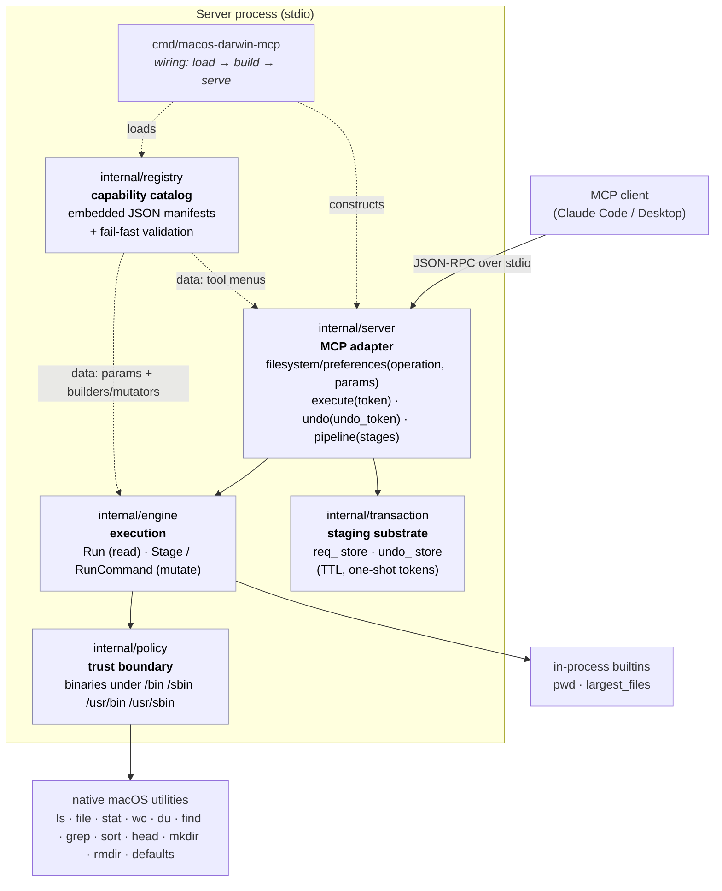
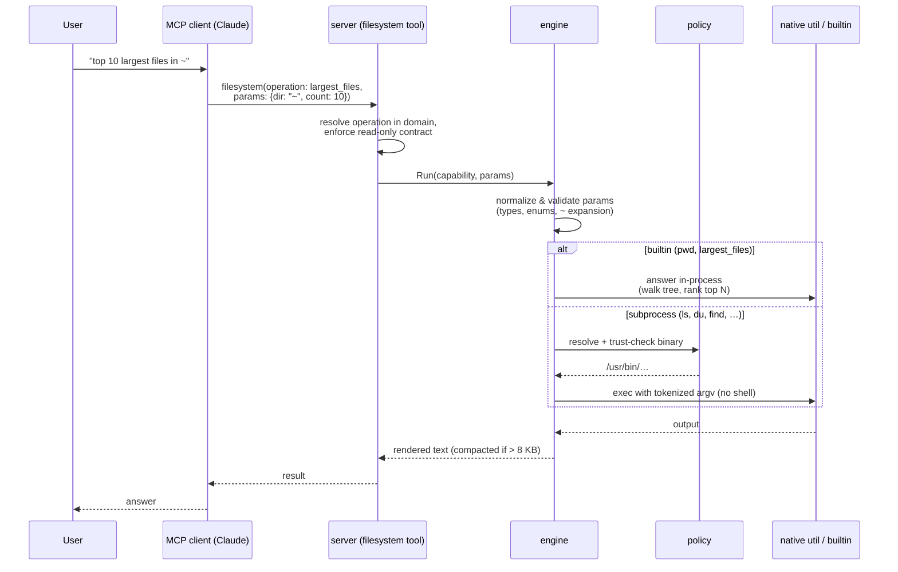
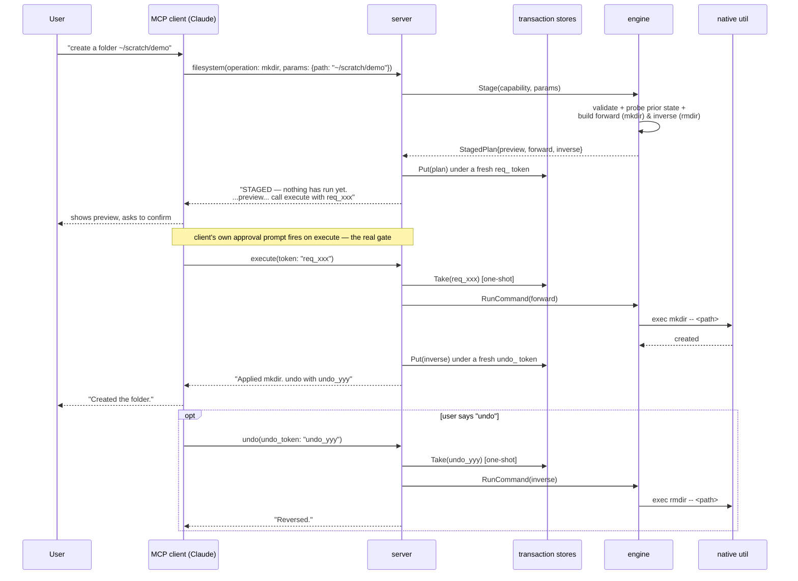

# mcp-server-mac-os

An MCP server for inspecting — and now safely modifying — a macOS system in
natural language through any MCP-aware client (Claude Code, Claude Desktop,
etc.).

The server wraps native macOS utilities behind a small, domain-shaped tool
surface. Read-only operations (list, search, measure, identify) run and return
immediately. Operations that change system state go through an explicit
**stage → execute → undo** gate: nothing is modified until a separate `execute`
call — the one a client should prompt the user to approve — commits a
previously-staged, previously-previewed plan. See [Mutating
operations](#mutating-operations-stage--execute--undo) below.

---

## What changed (and why it matters)

This codebase started as an MVP that registered one hand-written Go tool per
operation (`ls`, `grep`, `du`, …). That does not scale: every new operation meant
new tool code, and the model's tool list grew without bound. The server has since
been rebuilt around two ideas:

1. **Capabilities are data, not code.** Every operation is a JSON entry in a
   *capability manifest* describing the binary it runs, its parameters, and how
   those parameters map to command-line arguments. Adding an operation is a
   manifest edit, not new Go. A fixed **engine** turns any manifest entry into a
   validated, safely-executed command.

2. **The model sees domain tools, not the engine's plumbing.** Instead of one
   tool per operation (which doesn't scale) or a single opaque `query` tool (poor
   ergonomics), the server exposes **one tool per capability category** —
   `filesystem` and `preferences` today. You call a domain tool with an
   `operation` (a capability name) plus that operation's `params`. Each domain
   tool's description embeds the full menu of its operations and their
   parameters, so the model can form a correct call in one shot with no separate
   discovery step.

The net effect: the registry is the single source of truth, the engine enforces
every safety rule in one place, and the tool surface stays small and stable no
matter how many operations exist.

---

## System design



**Dependency direction is strictly one-way:** `server → engine → policy`, and all
three depend only on the registry's data types — never the reverse. That keeps the
catalog free of any execution or protocol concerns.

### How one request flows



### How a mutation flows



---

## Capabilities

Capabilities are grouped into categories, each reachable through its own domain
tool as `<domain>(operation: <name>, params: {…})`. Most operations are
read-only and run immediately; mutating ones go through the
[stage → execute → undo](#mutating-operations-stage--execute--undo) gate instead.

### `filesystem`

| Operation       | Runs            | Reversibility | Use it for                                        |
| --------------- | --------------- | -------------- | -------------------------------------------------- |
| `ls`            | `/bin/ls`       | read-only       | "What's in my Downloads folder?"                  |
| `pwd`           | *(builtin)*     | read-only       | "Where is the server running from?"               |
| `file`          | `/usr/bin/file` | read-only       | "What kind of file is this?"                      |
| `stat`          | `/usr/bin/stat` | read-only       | "When was this file last modified?"                |
| `wc`            | `/usr/bin/wc`   | read-only       | "How many lines are in this log?"                  |
| `du`            | `/usr/bin/du`   | read-only       | "How big is this folder?"                          |
| `find`          | `/usr/bin/find` | read-only       | "List all PNG and JPG files under `~/Pictures`."    |
| `grep`          | `/usr/bin/grep` | read-only       | "Which files mention `TODO`?"                       |
| `largest_files` | *(builtin)*     | read-only       | "What are the 10 biggest files under `~`?"          |
| `sort`          | `/usr/bin/sort` | read-only       | Rarely standalone — a [`pipeline`](#pipeline-composing-capabilities) stage that ranks another stage's output. |
| `head`          | `/usr/bin/head` | read-only       | Rarely standalone — a [`pipeline`](#pipeline-composing-capabilities) stage that trims a ranked/filtered result to a top-N answer. |
| `mkdir`         | `/bin/mkdir`    | **reversible**  | "Create a folder `~/scratch/demo`."                 |

### `preferences`

| Operation       | Runs              | Reversibility | Use it for                                        |
| --------------- | ----------------- | -------------- | -------------------------------------------------- |
| `write_setting` | `/usr/bin/defaults` | **reversible** | "Show hidden files in Finder." / "Auto-hide the Dock." |

`write_setting` does **not** take an arbitrary preference domain/key — it takes
a closed `setting` enum naming one of 15 curated, well-known, non-security-relevant
boolean toggles (see [Why `write_setting` is curated, not
generic](#why-write_setting-is-curated-not-generic) below for the full list and
the reasoning).

### Three ways a read-only capability is fulfilled

The engine resolves each read-only capability through one of three builders,
chosen by the manifest's `builder` field:

- **Generic builder** (most operations) — a fully declarative mapping. Each
  parameter's rule says how it becomes an argument (e.g. `{all: true}` → `-A`),
  flags first, then a `--` terminator, then positional operands.
- **Named builder** (`find`, `grep`) — small purpose-written Go for grammars the
  generic mapping can't express (e.g. `find` needs its search root *first* and its
  name filters combined into one parenthesized OR group).
- **Builtin** (`pwd`, `largest_files`) — answered in Go with no subprocess at all,
  for questions a single command can't answer in one call. `largest_files` is
  the clearest example: "biggest files" is a `du -a | sort -rn | head` *pipeline*
  idiom — a literal shell pipe is still forbidden, and even the server-side
  `pipeline` tool below would need the model to assemble three stages for
  something this common — so the builtin walks the tree once, keeps only the
  top N in a bounded heap, and returns just those ranked lines in a single call.
  Output is small by construction and never floods the model's context.

A mutating capability is fulfilled differently — see [Mutating
operations](#mutating-operations-stage--execute--undo) below. Composing
*multiple* read-only capabilities together (when no single one or named
builtin already answers the question) is the `pipeline` tool's job — see the
next section.

---

## `pipeline`: composing capabilities

Some questions need more than one capability chained together — "how many
`.conf` files are under `/etc`?" needs `find` to list matches and `wc` to count
them — but don't justify a bespoke builtin the way `largest_files` did for
"biggest files." The `pipeline` tool is the general escape hatch: an ordered
list of stages where each stage's raw output feeds the next stage's input,
the server-side equivalent of a unix `a | b | c` pipe with no shell involved
(every stage is still launched via `exec.CommandContext` with its own
validated, explicit argv — see [Why this server is safe to
expose](#why-this-server-is-safe-to-expose)).

```
pipeline(stages: [
  { capability: "find", params: { path: "/etc", extensions: ["conf"] } },
  { capability: "wc",   params: { lines: true } }
])
```

Notice the second stage omits `paths` — that's how a stage consumes the
*previous* stage's output instead of a named file, the same way `wc` reads
stdin in a real shell pipe when given no file argument.

**Scope, deliberately narrow:**
- **Read-only, binary-backed capabilities only.** Builtins (`pwd`,
  `largest_files`) have no subprocess to pipe; mutators (`mkdir`,
  `write_setting`) don't run in one step at all. This also means a pipeline
  never mutates anything — there is nothing to roll back, ever, so composition
  stays orthogonal to the mutation phase's transactional machinery.
- **`wc`, `grep`, `sort`, and `head`** can appear as a *non-first* stage,
  reading the prior stage's output from stdin instead of a file (the classic
  unix filter idiom). A capability that accepts this is marked
  `accepts_stdin` in its manifest entry; calling one of these four directly
  (outside a pipeline) without a file argument is refused immediately with a
  clear error rather than hanging forever waiting for input that will never
  arrive.
- **Limits**: at most 5 stages; each intermediate stage's raw output is capped
  at 1 MiB (generous on purpose — that data never reaches the model, it only
  has to fit in the server's own memory; the *final* stage's output still goes
  through the normal 8 KB model-facing compaction). A failing stage (non-zero
  exit, or — for a non-final stage — exceeding that cap) aborts the whole
  pipeline immediately, naming which stage and why.
- **Sequential, not concurrently streamed.** Each stage runs to completion and
  its captured output becomes the next stage's input, rather than every stage
  running concurrently with a live OS-level pipe between them. Simpler and
  exactly as correct at this project's scale (a handful of capped stages); see
  `docs/issues/note-pipeline-design-decisions.md` for the reasoning.

**Nudged toward named operations first.** The tool's own description tells
the model to check the relevant domain tool's operation menu and prefer a
single named operation whenever one exists — composing a pipeline is meant for
the long tail no named capability covers yet. This is checked mechanically,
not just hoped for: several eval cases assert `forbid_tools: ["pipeline"]`
for prompts a single named operation already answers (see
[Evals](#evals)).

---

## Mutating operations (stage → execute → undo)

Read-only capabilities are a pure function of their parameters, so they run and
return in one call. A mutation cannot work that way: the only safe moment to show
a human what will happen — and the only moment the server can capture the prior
state needed to reverse it — is *after* validation but *before* anything runs. So
a mutating capability (selected by a manifest `builder` registered as a
**mutator**, e.g. `mkdir`) is split into three steps, bridged by opaque,
single-use, expiring tokens (`internal/transaction`):

1. **Stage** — calling the domain tool with a mutating `operation` does **not**
   run anything. The engine validates the parameters, does any read-only probing
   needed (e.g. confirming the target doesn't already exist), and resolves both
   the *forward* command and its *inverse* up front. The result is stashed
   server-side under a fresh `req_…` token; the model gets that token plus a
   plain-language preview ("Create directory X. Undo will remove it.").
2. **Execute** — the model calls the shared `execute` tool with the token. This
   is the only step that actually changes the system, and it is the step an MCP
   client should gate with its own "Allow this tool call?" approval prompt — that
   client-side prompt is the real, enforceable confirmation; anything the model
   says in chat ("shall I proceed?") is UX layered on top, not a lock. `execute`
   consumes the token (so a staged plan can be committed at most once) and, if
   the change is reversible, returns a fresh `undo_…` token.
3. **Undo** — the model calls the shared `undo` tool with that token to run the
   pre-resolved inverse command. Like `execute`, the token is consumed on use.

Both tokens expire on their own (15 minutes for a staged-but-uncommitted plan, 1
hour for a committed change's undo window), so an abandoned plan or a long-forgotten
change cannot be acted on far outside the period the preview/result was shown.

**Why `execute` and `undo` are tools, not capabilities:** they are generic over
*any* staged plan — the model never names an operation when calling them, only a
token. This is also why the architecture can add many more mutating capabilities
later without growing the tool surface: only the per-domain operation menu grows.

Two mutators exist today:
- **`mkdir`** — forward is `mkdir -- <path>`, inverse is `rmdir -- <path>` (which
  refuses a non-empty directory, so undo can never destroy files added after the
  create). Staging refuses a path that already exists or begins with `-`.
- **`write_setting`** — unlike `mkdir`'s fixed inverse, undo here needs to know
  what to restore. Staging reads the setting's *current* value (a harmless
  `defaults read`) and bakes that exact prior value into the inverse: forward is
  `defaults write <domain> <key> -bool <new>`, inverse is either `defaults write
  <domain> <key> -bool <prior>` or, if the key was unset, `defaults delete
  <domain> <key>`. Staging refuses to proceed if the existing value isn't a plain
  boolean — it never guesses how to round-trip a value shape it doesn't
  understand.

### Why `write_setting` is curated, not generic

`defaults write` is, on its own, unrestricted within the calling user's account —
some settings it can reach are genuinely dangerous (e.g. disabling the password
prompt after sleep/screensaver). Exposing raw `domain`/`key` parameters would let
the model target *any* preference, most of which neither it nor a human glancing
at a confirmation prompt can assess the consequences of. So `write_setting` takes
a closed `setting` enum instead; the real domain/key pair behind each name lives
in Go (`internal/engine/mutate_preferences.go`'s `defaultsAllowlist`), never in
model-controlled input — the same posture `policy.allowedBinDirs` takes for
trusted binaries. A test (`TestDefaultsAllowlist_MatchesManifestEnum`) keeps the
manifest's enum and this Go map from drifting apart.

| `setting`                          | Domain                    | Key                                    |
| ----------------------------------- | ------------------------- | --------------------------------------- |
| `finder_show_hidden_files`          | `com.apple.finder`        | `AppleShowAllFiles`                     |
| `finder_show_all_extensions`        | `NSGlobalDomain`          | `AppleShowAllExtensions`                |
| `finder_show_path_bar`              | `com.apple.finder`        | `ShowPathbar`                           |
| `finder_show_status_bar`            | `com.apple.finder`        | `ShowStatusBar`                         |
| `finder_warn_on_extension_change`   | `com.apple.finder`        | `FXEnableExtensionChangeWarning`        |
| `dock_autohide`                     | `com.apple.dock`          | `autohide`                              |
| `dock_show_recents`                 | `com.apple.dock`          | `show-recents`                          |
| `dock_minimize_to_app_icon`         | `com.apple.dock`          | `minimize-to-application`               |
| `dock_show_process_indicators`      | `com.apple.dock`          | `show-process-indicators`               |
| `screenshot_disable_shadow`         | `com.apple.screencapture` | `disable-shadow`                        |
| `global_press_and_hold_accents`     | `NSGlobalDomain`          | `ApplePressAndHoldEnabled`               |
| `global_autocorrect`                | `NSGlobalDomain`          | `NSAutomaticSpellingCorrectionEnabled`  |
| `global_smart_quotes`               | `NSGlobalDomain`          | `NSAutomaticQuoteSubstitutionEnabled`   |
| `global_smart_dashes`               | `NSGlobalDomain`          | `NSAutomaticDashSubstitutionEnabled`    |
| `global_period_substitution`        | `NSGlobalDomain`          | `NSAutomaticPeriodSubstitutionEnabled`  |

Every entry is a well-documented, reversible, purely cosmetic/UX toggle with no
security, login, or networking implications — settings of that kind (password
prompts, login window behavior, firewall, Gatekeeper, sharing, FileVault, TCC,
SIP, etc.) are deliberately excluded and are not planned to be added. Adding a
new curated setting means a reviewed Go code change (the allowlist) plus a
manifest edit (the enum) — not just a data edit — which is intentional friction
for something security-adjacent. An open "any domain/key" mode has been
considered and rejected: the curation *is* the safety value, not a speed bump in
front of one, and a confirmation prompt doesn't help if nobody reviewing it knows
what an arbitrary key actually does.

---

## Why this server is safe to expose

- **No shell, ever.** Every utility is invoked with `exec.CommandContext` and a
  pre-tokenized `[]string`. There is no `sh -c`, no string concatenation, no glob
  expansion performed by us.
- **Trusted binaries only.** Each binary is resolved and verified to live under
  `/bin`, `/sbin`, `/usr/bin`, or `/usr/sbin` before it can run — for read-only
  commands, a mutation's forward/inverse commands, and every stage of a
  `pipeline` call alike; there is no separate, looser execution path for
  composed stages.
- **Mutations never run on the first call.** `find` is still exposed without
  `-exec`, `-delete`, or `-prune`. Any capability that changes state instead goes
  through [stage → execute → undo](#mutating-operations-stage--execute--undo):
  the model gets a token and a preview, and only a separate `execute` call —
  meant to be gated by the client's own approval prompt — can change anything.
  `execute` takes a token, never a raw command, so the model cannot smuggle in a
  different action between staging and execution.
- **Strict input validation.** Every parameter is checked against its manifest
  spec (type, required-ness, enum membership) before any argument is assembled.
  `find`'s `extensions` filter rejects anything but `[A-Za-z0-9_-]+`; its `type`
  is restricted to `f`, `d`, or `l`; dash-leading search roots are rejected so
  they can't be reinterpreted as flags.
- **Output budget.** Subprocess output larger than 8 KB is compacted to a
  head + tail window with a notice, so a verbose utility can't saturate the
  model's context. A `pipeline` call's intermediate stages are capped more
  generously (1 MiB — that data never reaches the model, only the server's own
  memory), but the *final* stage a pipeline returns still goes through the
  same 8 KB model-facing compaction as any other result.
- **Stdout discipline.** All logs go to `os.Stderr`; `os.Stdout` is reserved
  exclusively for JSON-RPC framing.
- **macOS permission model.** The server runs as the user that started it and
  inherits their Full-Disk-Access, Files-and-Folders, and POSIX permissions.
  Permission denials surface verbatim from the underlying utility (look for
  `[stderr]` in tool output).

---

## Codebase structure

```
cmd/
  macos-darwin-mcp/
    main.go                    # entry point — wiring only: load registry → build server → serve over stdio
  runevals/
    main.go                    # eval harness entry point — flags → internal/evals.Run (see "Evals")

internal/
  registry/                    # the capability catalog (pure data; no exec, no MCP)
    types.go                   #   Capability / ParamSpec / ArgRule + closed enums
    registry.go                #   embed + load + fail-fast structural validation
    manifests/
      filesystem.json          #   12 filesystem capabilities (11 read-only incl. sort/head + mkdir) as JSON data
      preferences.json         #   write_setting (the curated "setting" enum) as JSON data
  engine/                      # execution: turn a capability + params into output
    engine.go                  #   Run pipeline (read): normalize → builder/builtin → policy → exec
    validate.go                #   parameter normalization & type coercion (input guardrail)
    argbuild.go                #   generic declarative argv builder + typed accessors
    builders_filesystem.go     #   named builders for irregular grammars (find, grep)
    builtins.go                #   builtin registry (pwd)
    builtins_filesystem.go     #   largest_files in-process tree walk + ranking
    executor.go                #   subprocess runner, ~ expansion, 8 KB output compaction; runCommandWithStdin
    mutate.go                  #   generic mutation machinery: Mutator/Command/StagedPlan, Stage/RunCommand
    mutate_filesystem.go       #   mkdir mutator
    mutate_preferences.go      #   write_setting mutator + the defaultsAllowlist curated settings map
    pipeline.go                #   RunPipeline: chains read-only, binary-backed stages (see "pipeline" above)
  policy/
    binaries.go                # the trust boundary: which binaries may run, and from where
  transaction/                 # the stage↔execute/undo bridge (no deps on engine/registry/MCP)
    store.go                   #   generic, thread-safe, TTL one-shot token store
  server/                      # the MCP adapter (depends on engine + registry + transaction)
    tools.go                   #   domain tools + execute/undo; the request handlers
    menu.go                    #   render each domain tool's embedded operation/param menu
    pipeline.go                #   the pipeline tool: resolves stage names + renders its description
    inprocess.go               #   Connect(): wires a real Server to an in-memory MCP client,
                                #   shared by the integration test and the eval harness
  evals/                       # the eval harness's logic (see "Evals"); not part of the shipped binary
    case.go                    #   Case/Turn/Expectation types + LoadCases (JSON, not YAML — zero new deps)
    anthropic.go               #   minimal net/http Messages API client
    runner.go                  #   the agent loop: real model ↔ real server, capped at 6 rounds/turn
    expectation.go             #   pure CheckExpectation logic (unit tested with no network)

evals/
  cases/                       # the actual eval fixtures (dev-only data, never embedded in the binary)
    *.json
```

The architectural ground rules behind these choices live in `CLAUDE.md` and
`.claude/rules/*.md`; the design rationale is recorded in `docs/ideas/` and
`docs/specs/`.

---

## Build

The project targets Go 1.26+ (matching `go.mod`) and the official MCP Go SDK.

```bash
go mod tidy
go build -o bin/macos-darwin-mcp ./cmd/macos-darwin-mcp
```

For a Universal 2 binary that runs natively on both Apple Silicon and Intel Macs:

```bash
GOOS=darwin GOARCH=arm64  go build -o bin/mcp-server-arm64 ./cmd/macos-darwin-mcp
GOOS=darwin GOARCH=amd64  go build -o bin/mcp-server-intel ./cmd/macos-darwin-mcp
lipo -create -output bin/macos-darwin-mcp bin/mcp-server-arm64 bin/mcp-server-intel
rm bin/mcp-server-arm64 bin/mcp-server-intel
```

---

## Install

### Claude Code

```bash
claude mcp add mac-os-fs -- /absolute/path/to/bin/macos-darwin-mcp
claude mcp list   # should show mac-os-fs connected
```

This registers a `stdio` MCP server named `mac-os-fs` exposing the `filesystem`
domain tool. **Restart your Claude Code session** after (re)building so a stale
tool list is refreshed.

### Claude Desktop

Edit `~/Library/Application Support/Claude/claude_desktop_config.json`:

```json
{
  "mcpServers": {
    "mac-os-fs": {
      "command": "/absolute/path/to/bin/macos-darwin-mcp"
    }
  }
}
```

Then **quit and relaunch** Claude Desktop. The client launches the binary once at
startup and does not hot-reload — always restart after rebuilding.

> **Old vs new server, quick tell:** if you see the model calling a tool named
> `query` (or `list_capabilities` / `describe_capability`), you're on an older
> build. The current server exposes one domain tool per category
> (`filesystem`, `preferences`) plus the shared `execute`/`undo` pair.

---

## Try it in natural language

Once registered, prompts like these get answered by Claude calling the right
tool — `filesystem` or `preferences` for a single operation, `pipeline` to
combine a few, and `execute`/`undo` for the mutation confirmation flow.

### Read-only (run immediately, no confirmation)

- *"What are the 10 biggest files under my home directory?"* →
  `largest_files` (one call, ten ranked lines — not a flood of paths).
- *"List all image files (PNG, JPG, HEIC, GIF) under `~/Pictures`."* →
  `find` with `extensions=["png","jpg","jpeg","heic","gif"]`.
- *"Which files in this repo contain `TODO`?"* → `grep` with `recursive=true`.
- *"How big is my Downloads folder?"* → `du` with `max_depth=0`.
- *"What kind of file is `~/Downloads/mystery.bin`?"* → `file`.
- *"How many lines are in `/var/log/system.log`?"* → `wc` with `lines=true`.

### Mutating — stages first, only changes anything after you confirm

These go through [stage → execute →
undo](#mutating-operations-stage--execute--undo): Claude shows you what will
happen, your client prompts to approve the actual `execute` call, and nothing
on disk or in your preferences changes before that.

- *"Create a folder called `drafts` inside my Documents."* → `filesystem`
  stages `mkdir` and shows a preview ("Create directory `~/Documents/drafts`.
  Undo will remove it."). Confirm, and Claude calls `execute` to actually
  create it.
- *"Turn on showing hidden files in Finder."* → `preferences` stages
  `write_setting` (`setting=finder_show_hidden_files, value=true`) the same
  way — preview first, `execute` only after you say go ahead.
- *"Actually, undo that."* (right after either of the above) → Claude calls
  `undo` with the token from the `execute` result; the folder is removed, or
  the Finder setting is restored to whatever it was before.

### Combining capabilities — `pipeline`, for the long tail no named op covers

- *"How many `.log` files are under `/var/log`?"* → `pipeline` chaining
  `find` (list the matches) into `wc` (count the lines) — one call instead of
  Claude counting a file listing by hand.
- *"Rank my home directory's top-level folders by disk usage, biggest
  first."* → `pipeline` chaining `du` (per-folder totals, `max_depth=1`) into
  `sort` (`human_numeric=true, reverse=true`) — `largest_files` doesn't cover
  this since it ranks *files*, not directories, so this is exactly the case
  `pipeline` exists for.

The first time Claude reaches into a protected location (Desktop, Documents,
Downloads, iCloud Drive, external volumes, …), macOS prompts for permission for
the **host process that launched Claude**. Granting once is enough.

---

## Develop & test

```bash
gofmt -l ./cmd ./internal   # should print nothing
go vet ./...
go test ./...
go test -race ./internal/transaction/...   # the concurrent token store
```

See `docs/TESTS.md` for a per-package breakdown of what the suite actually
verifies (and what it deliberately doesn't — see the eval-harness note there).
The in-process MCP integration test (`internal/server/integration_test.go`) is
the canonical end-to-end check; piping JSON into the binary by hand is
unreliable because the server exits on stdin EOF before flushing replies (see
`docs/issues/issue-stdio-smoke-test-unreliable.md`).

Tests that exercise `write_setting` never run `defaults write`/`delete` against
the real curated domains (`com.apple.finder`, `com.apple.dock`,
`NSGlobalDomain`) — they use a synthetic allowlist entry pointed at a disposable
temp file instead, so running the suite never touches your actual Finder/Dock
settings.

---

## Evals

`go test ./...` proves the engine/protocol are correct *given* a specific tool
call. It cannot catch a different failure mode: a real model picking the
*wrong* tool for a prompt, or — the safety-critical case — calling `execute`
in the same turn it staged a change, without a human ever seeing the preview.
That needs an actual model in the loop, which `internal/evals` provides.

```bash
# Free, no API key needed: validates case files and resolves tool schemas only.
go run ./cmd/runevals -dry-run

# Live: makes real, billed Anthropic API calls (a few cents for the full set).
export ANTHROPIC_API_KEY=sk-ant-...
go run ./cmd/runevals
go run ./cmd/runevals -only mkdir_stages_then_confirms_then_undoes   # one case
```

How it works: for each case in `evals/cases/*.json`, the harness sends the
prompt to `claude-sonnet-4-6` with the *real* domain tool schemas attached
(read straight off the live in-process server via `server.Connect` — the same
helper the integration tests use, no hand-duplicated schemas). Any tool the
model calls is executed for real against the real engine; the result is fed
back, and the exchange repeats (capped at 6 rounds — exceeding that is itself
a reported failure, mirroring the original `largest_files` loop incident) until
the model yields back to the user. The case's `expect` block is then checked:
which tool/operation was called, which tools must NOT have been called
(`forbid_tools`, the auto-confirm guard), and any required substrings in the
response text.

**Scope caveat:** the real, enforceable confirmation gate on `execute` is the
MCP *client's* own "Allow this tool call?" prompt — something a raw Messages
API call has no concept of. This harness measures a narrower, softer signal:
does the model, given only the tool descriptions and conversation, naturally
avoid chaining stage→execute in one turn. That's worth catching but is not a
substitute for the client-side gate.

**Mutation cases have real side effects, by design** — `mkdir_*` cases really
create a directory under `/tmp` (a fresh `{{unique}}`-templated name each run,
so reruns never collide) and `write_setting_*` cases really flip a real Finder
preference. Both are written as 3-turn stage→confirm→undo scripts so a fully
passing live run is self-cleaning; see `evals/cases/mutation_confirmation.json`.

See `docs/issues/issue-need-eval-harness-for-tool-selection.md` for the
original design rationale, and `docs/TESTS.md` for how this fits alongside the
regular test suite.

---

## Roadmap

The read-only foundation, the domain-tool surface, the
stage → execute → undo mutation gate, and read-only composition
([`pipeline`](#pipeline-composing-capabilities)) are all in place. Mutation is
proved on two mutators with different undo shapes: `mkdir` (a fixed inverse)
and `write_setting` (an inverse that depends on prior state captured at stage
time). What's next:

- **Eval breadth**: the harness (`internal/evals`, see [Evals](#evals)) exists
  with 15 cases against `claude-sonnet-4-6`; widening model coverage and adding
  cases as new domains/capabilities ship is ongoing, not one-and-done.
- **Breadth**: more curated `preferences` settings and mutating capabilities in
  other domains (e.g. `network`, `application`); more pipeline-eligible
  capabilities as real composition needs surface.
- **Irreversible operations**: a heavier confirmation gate plus a Trash/staging
  (`~/.Trash`, `/tmp/mcp-fallback/`) fallback for operations with no true
  inverse, instead of a false promise of undo.
- **Multi-step *mutation* plans**: distinct from the read-only `pipeline` tool
  above — a single domain call that stages and commits several *mutations*,
  with a **best-effort + report** failure policy (stop on first failure,
  report what completed, let the user `undo` the completed reversible steps).
  See `docs/issues/issue-composition-and-transactional-rollback-limitations.md`
  for why this is still open even though read-only composition is now done.
- **Force mode**: an explicit opt-in to skip the `execute` confirmation step for
  low-risk reversible operations — never available for irreversible ones.

See `docs/` for the design notes and the approved plans.
