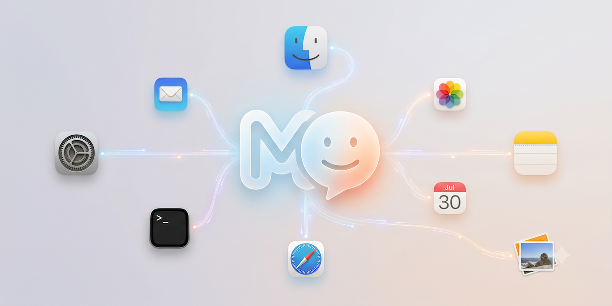

# Mac OS MCP Server



[](https://www.apple.com/macos/)
[](https://go.dev/)
[](https://modelcontextprotocol.io/)
[](LICENSE)

### 🖥️ **Your Personal Mac Assistant**
**Talk to your Mac**. No more memorizing Terminal commands, no more digging through System Settings, no more looking up how to navigate and do things on your Mac.

> This is a Model Context Protocol (MCP) server that turns plain-language requests
> into safe, native macOS actions — your files, Mail, Calendar, Reminders, 
> Messages, Notes, Contacts & calls, Music, apps, printers, and system settings — 
> from any MCP-aware client like **Claude Code** or **Claude Desktop**.

Pair this server with an MCP-aware client like **Claude Code** or **Claude
Desktop** and the two together act as a **personal Mac assistant** — one place to interact with your Mac in ordinary language. Ask —

> *"Text Bob Jones that I'm running 10 minutes late."* ·
> *"Put a dentist appointment for Thursday at 2pm."* · *"Find my tax return and
> email it to Jim Smith."* · *"I can't reach the internet — diagnose the issue."* ·
> *"Find the 10 biggest files in my home folder and tell me the last time they were opened."* · *"What's draining my battery?"* · *"Print invoice.pdf in my Downloads folder."*

— and the model answers by calling **real, audited macOS tools**. Most actions give you a preview first, and ask you to confirm and approve before execution. **Nothing** changes on your Mac without you seeing exactly what will happen first and without you giving explicit approval.

With a client like **Claude Desktop** or **Claude Code** that allows secure remote session access, you can control your Mac device remotely from your phone or from another machine. This enables you to monitor and control your Mac on the go!

---

## ✨ What you can do

This isn't a sandbox of toy commands — it's a practical, everyday assistant for
the Mac you already use. **19 domains, 131 operations**, each invokable in plain
language. Read operations return immediately; **bold** ones change system state
and always ask first (see [Safe by design](#-safe-by-design)).

### 📁 Files & disk

Find things, measure things, and tidy up — without memorizing `find` flags or
`du` incantations.

- *"What are the 10 biggest files under my home directory?"*
- *"Find the presentation about Q3 planning."* · *"Search my Documents for anything about the annual budget."* *(Spotlight — searches contents and metadata, not just filenames)*
- *"List every PNG, JPG, and HEIC under `~/Pictures`."*
- *"Which files in this project mention `TODO`?"*
- *"How big is my Downloads folder?"*
- *"How many lines are in `/var/log/system.log`?"*
- *"What are the dimensions and format of this photo?"* *(reads the image's pixel size, format, DPI — read-only)*
- **"Convert this HEIC to a JPEG."** · **"Resize this image to 800px wide."** *(writes a new file, never overwriting the original — previewed; undo trashes it)*
- **"Convert my notes.rtf to a Word document."** *(text/HTML/RTF/RTFD/DOCX/ODT — previewed; undo trashes the new file)*
- *"Make me a thumbnail preview of this PDF."* *(a Quick Look preview PNG in a temp folder — runs immediately; undoable)*
- **"Create a folder called `drafts` in my Documents."** *(previewed; undoable)*
- **"Move `test.txt` from Downloads to the Desktop."** · **"Move all the screenshots on my Desktop into `~/Desktop/screenshots`."** · **"Copy this report into `~/Backups`."** *(previewed; undoable)*
- **"Delete `old-draft.txt`."** *(moved to the Trash, never hard-deleted — previewed; undoable)*
- **"Create a file called `notes.txt` in my Documents with these three lines."** *(previewed; creates new files only — never overwrites; undo trashes it)*
- **"Add 'call the plumber' to the end of my `todo.txt`."** *(previewed; undo restores the file byte-for-byte)*
- **"Zip up my `project` folder into `project.zip`."** · **"Extract `backup.tar.gz` into an empty folder."** *(previewed; undoable — a malicious archive can't write outside the folder you choose)*

### ✉️ Mail

Read your inbox and draft outgoing mail — with the recipient and full body shown
verbatim before anything sends.

- *"Show me my most recent emails."* *(lists sender, subject, date — read-only)*
- *"Open the one from billing and read it to me."* *(reads a single message's full body — read-only)*
- *"Find emails mentioning invoice INV-4471."*
- **"Email Alice to say I'll be 10 minutes late."** *(previewed; **cannot** be undone)*
- **"Find my 2025 tax return and email it to my accountant."** *(locates the file, then attaches it)*

### 📅 Calendar & Reminders

Read your schedule and manage events and to-dos — every change reversible with a
single "undo."

- *"What's on my calendar this week?"*
- **"Put a dentist appointment on Thursday at 2pm."**
- **"Move my 3pm review to 4pm."** · **"Cancel Friday's standup."**
- *"What reminders are due this week?"*
- **"Remind me to call the bank on Monday."** · **"Mark the dry-cleaning reminder done."**

### 💬 Messages & 📞 Calls

Read recent conversations, send texts (with attachments), and place calls — by
contact name or number.

- *"Any new messages?"* · *"Show my recent texts with Alice."*
- **"Text Bob that I'm running late."** · **"Send this PDF to Alice on iMessage."**
- *"What's Mom's number?"*
- **"Call Mom."** · **"FaceTime Bob."** *(names exactly who will be dialed, and how)*

### 📝 Notes

Find and read your notes, and jot new ones down — changes previewed and undoable.

- *"What folders do I have in Notes?"* · *"Show my most recent notes."*
- *"Find my note about the wifi password."* · *"Read the note titled 'Packing list'."*
- **"Make a note titled 'Trip ideas' with these three places."** *(previewed; undo deletes it)*
- **"Add 'buy sunscreen' to my packing-list note."** *(previewed; undo restores the prior contents)*

### 📷 Photos

Search your photo library, read a picture's details, and pull a photo out so the
assistant can actually look at it — plus light, previewed organizing.

- *"Find my photos from the beach."* · *"Search my photos for 'dog'."* *(uses Photos' own search — scenes, places, dates, text)*
- *"Show me my favorites."* · *"What albums do I have?"* · *"How many photos are in my library?"*
- *"Export that photo so you can see it."* *(writes a copy to a fresh folder and hands back the path — your library is untouched; GPS coordinates are shown only when you ask about one specific photo)*
- **"Mark this as a favorite."** · **"Rename this photo to 'Sunset at Ocean Beach'."** · **"Set this photo's keywords to 'vacation, beach'."** *(replaces that photo's keyword list; previewed; undo restores the prior value)*
- **"Make an album called 'Trip 2024'."** · **"Add these to my 'Best of' album."** · **"Import these pictures."** *(previewed; these have no automatic undo — the preview says exactly how to reverse them by hand)*
- **Photos never deletes.** The assistant cannot delete a photo or video — Photos' automation simply doesn't allow it — so your pictures are never at risk.

### 🚀 Apps

See what's installed and what's open, and drive your apps.

- *"What apps are installed?"* · *"What's open right now?"*
- **"Open Notes."** · **"Bring Safari to the front."** *(run immediately)*
- **"Open Leah.png in Preview."** *(previewed first — and it warns if the app may not handle that file type)*
- **"Open this PDF."** *(no app named — opens in your default app for that type)*
- **"Open YouTube."** · **"Open CNN.com."** · **"Open YouTube on Chrome."** *(opens a website in your browser — previewed first; uses the default browser unless you name one)*
- **"Quit Mail."** *(previewed first — unsaved work matters)*
- **"Download Slack."** · **"Is Xcode on the App Store, and what does it cost?"** *(checks whether it's already installed, searches the Mac App Store, then opens the app's page for you to click "Get" — installing is always your call, never automated; if it isn't on the store, it points you to the vendor's download page instead)*
- *"What windows do I have open, and where are they?"* *(lists each app's windows with position and size)*
- **"Move the Safari window to the top-left."** · **"Make it 1200 × 800."** · **"Minimize the TextEdit window."** *(run immediately, and undo puts the window back)*
- Window control uses the **Accessibility** permission (separate from Automation) — it says so plainly the first time if it isn't granted yet.

### 🧭 Safari

See what you have open in Safari — the assistant can read your tabs so it can
answer "what was that page?" or pick up where you left off.

- *"What tabs do I have open in Safari?"* *(lists every open tab — title and URL — grouped by window)*
- *"What page am I looking at right now?"* *(just the front window's active tab)*
- **Reads only.** It reads tab titles and addresses — it never runs code on a
  page or reads page contents. Open URLs can reveal what you're browsing, so it
  flags that these are private and reaches for them deliberately.
- The first use may ask you to grant **Automation** access to Safari.

### 👤 Contacts

Look up a person's full address-book card, or add a new one.

- *"Show me Jane's full contact card."* *(every field — phones, emails, postal
  addresses, birthday, organization — not just a number)*
- **"Add a contact for Jane Doe at Example Corp, email jane@example.com."**
  *(staged for your confirmation; **undo deletes exactly the card it created** —
  it's tagged with a hidden unique marker so no other contact can be touched)*
- A contact card is personal data, so the read reaches for it deliberately; the
  first use may ask you to grant **Automation** access to Contacts.

### 🎵 Music

Ask what's playing and drive playback in the Music app — hands-free skip and
pause without leaving what you're doing.

- *"What song is this?"* / *"What am I listening to?"* *(shows the track, artist,
  album, and whether it's playing or paused)*
- **"Pause my music."** / **"Skip this song."** / **"Go back a track."**
  *(run immediately — pausing or skipping is its own reversal, so there's no undo
  token; press play or skip again)*
- It **never launches Music just to answer** — if Music isn't running it simply
  says so.
- The first time it controls Music, macOS may ask you to grant **Automation**
  access to Music.

### 📸 Screenshots

Give the assistant eyes on your screen — it captures the screen to an image file
and hands back the path (plus size and dimensions) so it can look at what you see.
Capture the whole desktop, a rectangle you point out, or a single app's window.

- *"Take a screenshot."* · *"Grab a screenshot of my second display as a JPG."*
- *"Screenshot the 400×300 box at the top-left of my screen."* *(a specific
  rectangle — give the x, y corner plus a width and height)*
- *"Take a screenshot of the Safari window."* *(a single app's window — reads the
  window's position and photographs just that area)*
- *"Screenshot my screen and save it to ~/Desktop/login.png."* *(say where, or it
  defaults to `~/Pictures/Screenshots`; it won't overwrite an existing file)*
- All three need the **Screen Recording** permission; capturing a specific app
  window additionally uses **Accessibility** + **Automation** (to read the
  window's position). Any missing grant is called out plainly.

### 📋 Clipboard

Read what's on the clipboard, or put text on it.

- *"What's on my clipboard?"* · *"Show me what I just copied."* *(text only; it
  warns that the clipboard may hold something sensitive like a copied password)*
- **"Copy this address to my clipboard."** *(runs immediately; undo puts back
  whatever text was there before — unless the previous contents were an image or
  too large to hold, in which case it tells you there's nothing to restore)*

### 🖨️ Printers & ⚙️ System

Check hardware and network status, print, and jump straight to the right Settings
pane for anything that needs admin rights — or that simply has no command line at
all (pairing, iCloud sign-in, Focus, keyboard languages, screen mirroring), where
it opens the exact pane *and* tells you what to click once you're there.

- *"What printers do I have, and are they on?"* · *"What's in the print queue?"*
- **"Print this PDF."** · **"Print a test page on the office laser."**
- *"Is Wi-Fi on, what am I joined to, and is the signal any good?"* · *"Battery level? Is Low Power Mode on? How's my battery health?"*
- *"Is Bluetooth on? What's connected, and what's paired?"*
- *"What Mac do I have — which chip, how much memory?"* · *"How long since my last reboot?"*
- *"How much free disk space do I have?"* *(every mounted volume, sized like Finder shows)*
- *"Am I up to date on macOS?"* *(read-only check — installing stays in System Settings)*
- *"What can I mirror my screen to?"* *(finds AirPlay receivers — Apple TVs, TVs,
  other Macs — on your network; starting the mirroring stays in the Displays pane)*
- *"What keyboard languages / input sources do I have, and which is active?"*
- **"Open System Settings to Wi-Fi."** *(opens the pane for you to finish)*
- **"Pair my wireless mouse."** *(opens Bluetooth settings and walks you through pairing)*
- **"Sign me into iCloud."** · **"Turn on Do Not Disturb."** · **"Add a Chinese
  keyboard."** · **"Mirror my screen to the TV."** *(opens the Apple Account, Focus,
  Keyboard, or Displays pane with click-by-click instructions)*
- **"Notify me when the export is done."** · **"Say out loud that the backup finished."**
  *(a Notification Center banner or spoken text-to-speech — the model's way to get
  your attention when you're not watching the chat; runs immediately, nothing to undo)*
- **"Turn off my display but keep everything running."** *(sleeps the screen at once —
  wake it with a key press; nothing to undo from software)*
- **"Turn my Wi-Fi off."** · **"Turn Wi-Fi back on."** *(toggles the Wi-Fi radio;
  staged for confirmation because turning it off drops your connection, and undo
  restores the previous state — joining a specific network still needs the Wi-Fi pane)*

### 🌐 Network & diagnostics

Answer everyday network questions and let the model diagnose connectivity issues
by composing these probes. Read-only except for one benign, self-healing action
(flushing the DNS cache) — nothing here changes your network configuration.

- *"What's my IP, router, and MAC address? How many devices fit on this network?"*
- *"What DNS servers am I using?"* · *"What other devices are on my network?"*
- *"Can you ping the router? Can you reach 8.8.8.8?"* · *"Does apple.com resolve?"*
- *"Trace the route to 8.8.8.8 — where does it slow down?"* *(hop-by-hop path with
  per-hop latency, so a stalling or slow router is pinpointed, not just "unreachable")*
- *"Who owns example.com and when does it expire?"* *(WHOIS registration record)*
- *"Show my routing table"* · *"Which interface is carrying traffic, and any errors?"*
- *"What ports am I listening on, and which apps own them?"*
- *"Flush my DNS cache"* *(clears the on-demand resolver cache; it repopulates by
  itself — a full mDNSResponder reset still needs admin rights)*
- *"I can't reach the internet — can you diagnose it?"* *(checks the gateway, then a
  public IP, then DNS — and tells you where it breaks)*

> ℹ️ Turning Bluetooth on/off has no command line on macOS, so the model hands you
> off to System Settings for that — it can still tell you what's connected and paired.

### 📊 Processes & resources

See what's running and what it costs, find runaway or zombie processes, and stop a
misbehaving one *gracefully* — never a force-kill.

- *"What's eating my CPU / memory / battery right now?"* · *"Show the top memory hogs."*
- *"How loaded is my Mac overall?"* *(load average, per-core)* · *"How much RAM is free?"*
- *"How busy is the GPU?"* *(whole-device — per-process GPU isn't exposed without admin rights)*
- *"Tell me everything about PID 1234."* *(command, the binary responsible, parent,
  origin, start time, zombie state, whether launchd auto-starts it)*
- *"What did I install that starts automatically?"* *(launchd agents & daemons)*
- *"Quit Safari"* / *"stop that stuck process"* — a GUI app gets the normal **Quit**
  command (so it can prompt to save); a daemon gets a polite **SIGTERM**. Both are
  **staged for your confirmation** and never force-killed.

> ℹ️ Stopping a process is staged → you approve → it runs. We deliberately never send
> SIGKILL (force kill), which gives a program no chance to save or clean up.

### 🎛️ Preferences & accessibility

Flip well-known Finder, Dock, keyboard, and accessibility toggles — a curated set
of safe, reversible switches (no security-sensitive settings, ever) — read back
what any of them is currently set to, and switch between Dark and Light mode.

- **"Show hidden files in Finder."** · **"Auto-hide the Dock."**
- **"Is the Dock set to auto-hide right now?"** *(reads the current value)*
- **"Switch my Mac to Dark mode."** *(and undo puts the prior appearance back)*
- **"Turn on Reduce Motion."** · **"Increase contrast."**
- **"Turn off smart quotes."** *(every one of these is undoable)*

> 💡 Need more than one step? Ask naturally — *"How many `.log` files are under
> `/var/log`?"* — and the model composes the right tools for you. The full
> capability catalog, with the exact tool each prompt maps to, is in
> **[the architecture reference](docs/architecture.md#capabilities)**.

---

## 🔒 Safe by design

Giving an AI control of your Mac should make you cautious. This server is built so
that trust is earned structurally, not just promised:

- **Read vs. change is a hard line.** Anything that inspects your system runs and
  returns immediately. Anything that *changes* it is **staged** first: the model
  receives a plain-language preview and a one-time token, and **nothing happens
  until a separate `execute` step** — the step your MCP client gates with its own
  "Allow this tool call?" prompt.
- **Undo built in.** Reversible changes hand back an `undo` token. Created a folder
  or flipped a setting by mistake? "Undo that." Irreversible actions (sending mail,
  placing a call, printing) say so up front and show you everything verbatim before
  you commit.
- **No shell, ever.** Native utilities are run with explicit, tokenized arguments —
  never a shell string — so there is nothing to inject into. Binaries must resolve
  under `/bin`, `/sbin`, `/usr/bin`, or `/usr/sbin`, blocking rogue substitutes.
- **Curated, not open-ended.** Settings changes are limited to a vetted allowlist
  of harmless toggles; AppleScript, `tel:`/`facetime:` URLs, and SQL queries are
  all built from fixed templates with your input bound strictly as *data*.
- **Your permissions, your prompts.** The server runs as you and inherits your
  macOS permissions. The first time it touches protected data (Mail, Contacts,
  Messages, Desktop/Documents/Downloads…), macOS prompts you to grant access —
  once.

- **The guardrails are enforced by a security test gate.** These properties
  aren't just promised in prose — a cross-cutting security suite proves them and
  **must pass before every release** (CI runs it on every push). A registry-wide
  check fails the build if the surface ever grows to reference a destructive
  binary (`rm`, `diskutil`, `csrutil`, …) or lets an irrecoverable action skip the
  confirmation gate; a registry-driven injection sweep proves every
  model-controlled value lands as inert data; an end-to-end test fires SQL
  injection at a throwaway Messages database; and token-abuse tests prove a
  mutation can't be replayed or run unstaged. Adversarial live-model evals
  (refusing to wipe the disk, ignoring instructions injected into files it reads)
  and an everyday-Mac eval corpus that checks real end-state — a mutating case
  verifies the file actually landed where intended, not just that the right
  operation was chosen — round out the picture. See
  **[docs/TESTS.md](docs/TESTS.md)**.

The complete, line-by-line threat model is in
**[Why this server is safe to expose](docs/architecture.md#why-this-server-is-safe-to-expose)**.

---

## 🚀 Get started

### Requirements

- **macOS 13 Ventura or newer** (Apple Silicon or Intel)
- **[Go 1.26+](https://go.dev/dl/)** to build from source
- An MCP-aware client: **[Claude Code](https://claude.com/claude-code)** or
  **[Claude Desktop](https://claude.ai/download)**

### Build

```bash
go mod tidy
go build -o bin/macos-darwin-mcp ./cmd/macos-darwin-mcp
```

For a **Universal 2** binary that runs natively on both Apple Silicon and Intel:

```bash
GOOS=darwin GOARCH=arm64  go build -o bin/mcp-server-arm64 ./cmd/macos-darwin-mcp
GOOS=darwin GOARCH=amd64  go build -o bin/mcp-server-intel ./cmd/macos-darwin-mcp
lipo -create -output bin/macos-darwin-mcp bin/mcp-server-arm64 bin/mcp-server-intel
rm bin/mcp-server-arm64 bin/mcp-server-intel
```

### Connect it

**Claude Code:**

```bash
claude mcp add mac-os-mcp -- /absolute/path/to/bin/macos-darwin-mcp
claude mcp list   # should show mac-os-mcp connected
```

**Claude Desktop** — edit
`~/Library/Application Support/Claude/claude_desktop_config.json`:

```json
{
  "mcpServers": {
    "mac-os-mcp": {
      "command": "/absolute/path/to/bin/macos-darwin-mcp"
    }
  }
}
```

Then **restart your client** (Claude Code session, or quit & relaunch Claude
Desktop) — MCP clients load the tool list once at startup and don't hot-reload, so
always restart after (re)building.

You'll now have the 19 domain tools (`filesystem`, `preferences`, `application`,
`application-mail`/`-calendar`/`-reminders`/`-phone`/`-messages`/`-notes`/`-photos`/`-safari`/`-contacts`/`-music`,
`clipboard`, `printer`, `system`, `network`, `process`, `screenshot`) plus the shared
`execute`, `undo`, and `pipeline` tools. Try one of the prompts from
[What you can do](#-what-you-can-do) and watch the model pick the right tool.

> **Note on permissions:** reading Messages needs **Full Disk Access**, taking
> screenshots needs **Screen Recording**, and automating
> Mail/Calendar/Reminders/Contacts/Messages/Notes/Photos/Safari/Music needs a one-time **Automation**
> grant — all prompted by macOS the first time, under *System Settings → Privacy &
> Security*. Granting once is enough.

---

## 📱 Remote control your Mac from your phone

Here's where the command center gets genuinely powerful: you don't have to be
sitting at the Mac. Claude Code's built-in **Remote Control** lets you drive a
Claude session *that's running on your Mac* from the **Claude app on your phone**
(iOS/Android) or any browser at **[claude.ai/code](https://claude.ai/code)** — and
because the session stays on your Mac, this `mac-os-mcp` server and all its tools
come right along with it. From the couch or the bus you can ask your Mac to find a
file, text someone, check the print queue, or flip a setting, and watch it happen
on the machine at home.

This is a native Claude Code feature, **independent of this server** — you're
simply reaching the local session that already has `mac-os-mcp` connected. Nothing
about your Mac is exposed to the internet: your machine makes **outbound HTTPS only,
opens no inbound ports**, and the session never leaves your Mac for the cloud.

**What you need:** Claude Code **v2.1.51+** (`claude --version`), signed in with a
**claude.ai account** via `/login` (Pro, Max, Team, or Enterprise — API-key logins
aren't supported; on Team/Enterprise an admin enables it first), and this server
already added per [Get started](#-get-started) above. Remote Control is currently a
**research preview**.

**Turn it on (on the Mac).** From your project directory, either start a dedicated
session you steer from your phone:

```bash
claude remote-control          # prints a session URL; press space to show a QR code
```

…or flip on Remote Control for a normal interactive session you also type into
locally:

```bash
claude --remote-control "My Mac"
```

…or, if you're already in a session, just run `/remote-control` to hand the current
conversation off to your phone.

**Connect (on the phone).** Scan the QR code to jump straight into the **Claude
app**, or open the printed session URL in a browser, or open the Claude app / 
[claude.ai/code](https://claude.ai/code) and pick the session from the list (in the
mobile app, tap **Code**) — it shows a computer icon with a green dot when your Mac
is online. The conversation stays in sync across your terminal, browser, and phone
at once, and reconnects automatically if your Mac sleeps or the network drops.

As a bonus, with Remote Control active Claude can send **push notifications** to
your phone when a long task finishes or it needs a decision — handy when you've
kicked something off on the Mac and walked away. Enable it under `/config`.

> ⚠️ The session is a local process: if you close the terminal or quit the `claude`
> process on your Mac, remote control ends. Full details and flags are in
> Anthropic's **[Remote Control docs](https://code.claude.com/docs/en/remote-control)**.

---

## 🤝 Contributing

Contributions are very welcome — new capabilities, better docs, eval cases, bug
reports, and design discussion alike. The whole point of the architecture is that
**most new operations are a JSON manifest entry, not new Go code**, so adding to
your Mac's command center is genuinely approachable.

**The guiding vision:** the model, paired with an MCP-aware client, should be able
to do **anything a typical Mac user can do on their own machine** — every
everyday, point-and-click or menu-bar action, expressed in plain language. A
capability is in scope if a normal user could perform it themselves, even when it
needs a one-time permission grant in System Settings (Full Disk Access, Automation,
Screen Recording, and the like). What is explicitly **out of scope** is anything
that *strictly requires admin or root privileges* — this is deliberately **not** a
root-level sysadmin control server. If a `sudo` prompt or an administrator unlock
is the only way to do it, it doesn't belong here (the server points you to the
right Settings pane instead). When you propose a capability, that's the line to aim
at: full parity with an ordinary user, and nothing that demands elevated rights.

Start with **[CONTRIBUTING.md](CONTRIBUTING.md)** for the development setup, the
build/test/lint pipeline, how to add a capability, and the project's coding and
PR conventions.

---

## 🗺️ Roadmap

**The north star** is full parity with a human at the keyboard: every action a
typical Mac user can perform on their own device — files, apps, communication,
settings, hardware — reachable in plain language through your MCP client, so the
pairing becomes a true command center for the whole machine. The one firm boundary
is privilege: capabilities that **strictly require admin or root** are out of scope
(see [Contributing](#-contributing)). The server widens toward everything a normal
user can do, and stops there.

The read-only foundation, the 15-domain tool surface, the
stage → execute → undo mutation gate, and read-only composition (`pipeline`) are
all in place, with mutation proved across every undo shape the design anticipated
(fixed inverse, prior-state-dependent inverse, and genuinely irreversible).
What's next:

- **Eval breadth** — widen model coverage and add cases as new domains ship (the
  harness runs 18 cases against `claude-sonnet-4-6` today).
- **More capabilities** — more curated `preferences` settings, more `application-*`
  depth, and mutating capabilities in new domains (e.g. networking).
- **More file operations** — `move`, `copy`, and `remove` now ship (deletes recycle
  to the Trash, so every one is reversible); `move` also accepts a `source_glob`
  to move many files at once (the server expands the pattern on disk — handy for
  filenames you can't type exactly, like the narrow no-break space in macOS
  screenshot names — and stages the whole batch as one reversible step). Next is
  widening coverage (e.g. overwrite-with-backup, and the same batch `source_glob`
  for `copy`/`remove`) while keeping the Trash recovery guarantee.
- **Multi-step *mutation* plans** — stage and commit several changes with a
  best-effort + report failure policy (also what batch `copy`/`remove` need).
- **Force mode** — an explicit opt-in to skip the confirmation step for low-risk
  reversible operations (never for irreversible ones).

See [`docs/`](docs/) for the design notes and approved plans.

---

## 📐 Architecture & docs

This README is the tour; the engineering details live alongside the code:

- **[docs/architecture.md](docs/architecture.md)** — system design and request
  flow diagrams, the full capability catalog, the mutation model, the complete
  safety/threat model, the codebase map, and how to develop/test/eval.
- **[docs/TESTS.md](docs/TESTS.md)** — what the test suite verifies (and what it
  deliberately doesn't).
- **[docs/ideas/](docs/ideas/)**, **[docs/specs/](docs/specs/)**,
  **[docs/issues/](docs/issues/)** — design rationale, specs, and notes/known
  limitations.
- **[CLAUDE.md](CLAUDE.md)** and **[.claude/rules/](.claude/rules/)** — the
  non-negotiable engineering axioms every change follows.

---

## 📄 License

Licensed under the **GNU Affero General Public License v3.0** — see
[LICENSE](LICENSE). Contributions are accepted under the same license.

Disclaimer: This project is an independent, open-source utility and is not affiliated with Apple Inc. Any Mac-specific logos in this README are trademarks of Apple Inc.
