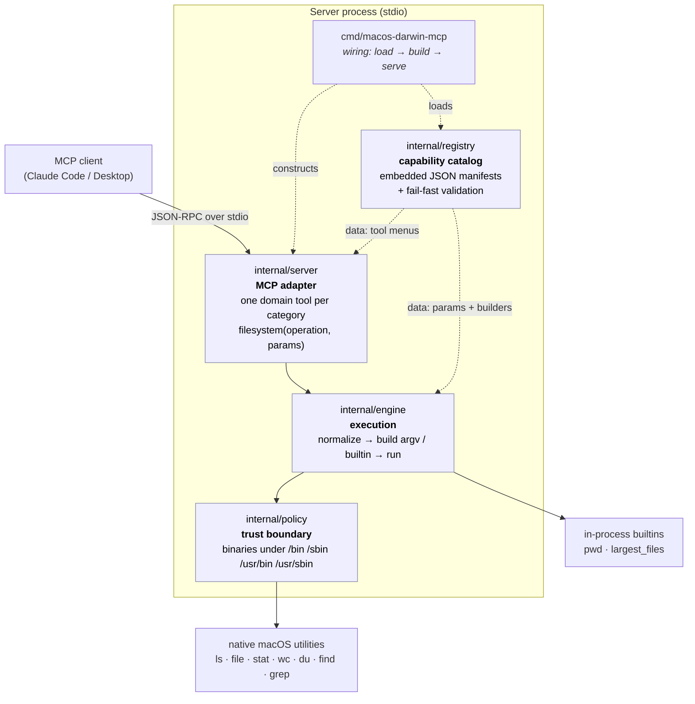
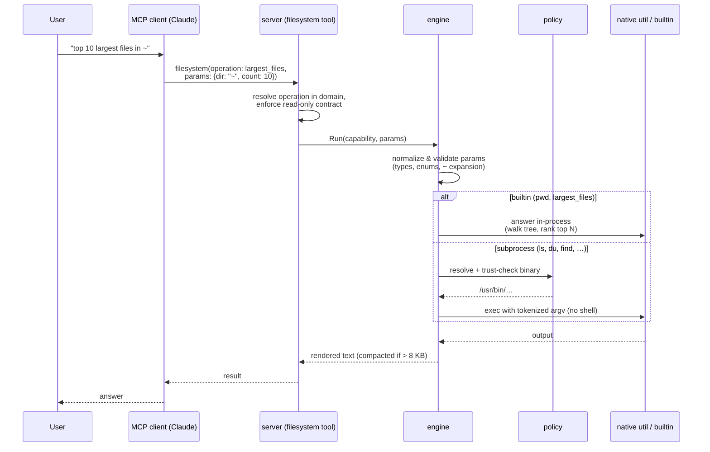

# mcp-server-mac-os

A read-only MCP server for inspecting a macOS system in natural language through
any MCP-aware client (Claude Code, Claude Desktop, etc.).

The server wraps native macOS utilities behind a small, **non-mutating** tool
surface: it can list, search, measure, and identify files, but it cannot create,
modify, move, or delete anything. Mutating operations (with staging, confirmation,
and undo) are a planned later phase — see [Roadmap](#roadmap).

---

## What changed (and why it matters)

This codebase started as an MVP that registered one hand-written Go tool per
operation (`ls`, `grep`, `du`, …). That does not scale: every new operation meant
new tool code, and the model's tool list grew without bound. The server has since
been rebuilt around two ideas:

1. **Capabilities are data, not code.** Every operation is a JSON entry in a
   *capability manifest* describing the binary it runs, its parameters, and how
   those parameters map to command-line arguments. Adding an operation is a
   manifest edit, not new Go. A fixed **engine** turns any manifest entry into a
   validated, safely-executed command.

2. **The model sees domain tools, not the engine's plumbing.** Instead of one
   tool per operation (which doesn't scale) or a single opaque `query` tool (poor
   ergonomics), the server exposes **one tool per capability category** — today a
   single `filesystem` tool. You call it with an `operation` (a capability name)
   plus that operation's `params`. Each domain tool's description embeds the full
   menu of its operations and their parameters, so the model can form a correct
   call in one shot with no separate discovery step.

The net effect: the registry is the single source of truth, the engine enforces
every safety rule in one place, and the tool surface stays small and stable no
matter how many operations exist.

---

## System design



**Dependency direction is strictly one-way:** `server → engine → policy`, and all
three depend only on the registry's data types — never the reverse. That keeps the
catalog free of any execution or protocol concerns.

### How one request flows



---

## Capabilities

All capabilities live in the `filesystem` category and are reachable through the
`filesystem` domain tool as `filesystem(operation: <name>, params: {…})`.

| Operation       | Runs            | Use it for                                                   |
| --------------- | --------------- | ------------------------------------------------------------ |
| `ls`            | `/bin/ls`       | "What's in my Downloads folder?"                             |
| `pwd`           | *(builtin)*     | "Where is the server running from?"                          |
| `file`          | `/usr/bin/file` | "What kind of file is this?"                                 |
| `stat`          | `/usr/bin/stat` | "When was this file last modified?"                          |
| `wc`            | `/usr/bin/wc`   | "How many lines are in this log?"                            |
| `du`            | `/usr/bin/du`   | "How big is this folder?"                                    |
| `find`          | `/usr/bin/find` | "List all PNG and JPG files under `~/Pictures`."             |
| `grep`          | `/usr/bin/grep` | "Which files mention `TODO`?"                                |
| `largest_files` | *(builtin)*     | "What are the 10 biggest files under `~`?"                   |

### Three ways a capability is fulfilled

The engine resolves each capability through one of three builders, chosen by the
manifest's `builder` field:

- **Generic builder** (most operations) — a fully declarative mapping. Each
  parameter's rule says how it becomes an argument (e.g. `{all: true}` → `-A`),
  flags first, then a `--` terminator, then positional operands.
- **Named builder** (`find`, `grep`) — small purpose-written Go for grammars the
  generic mapping can't express (e.g. `find` needs its search root *first* and its
  name filters combined into one parenthesized OR group).
- **Builtin** (`pwd`, `largest_files`) — answered in Go with no subprocess at all,
  for questions a single command can't answer. `largest_files` is the clearest
  example: "biggest files" is a `du -a | sort -rn | head` *pipeline*, which the
  no-shell rule forbids — so the builtin walks the tree once, keeps only the top N
  in a bounded heap, and returns just those ranked lines. Output is small by
  construction and never floods the model's context.

---

## Why this server is safe to expose

- **No shell, ever.** Every utility is invoked with `exec.CommandContext` and a
  pre-tokenized `[]string`. There is no `sh -c`, no string concatenation, no glob
  expansion performed by us.
- **Trusted binaries only.** Each binary is resolved and verified to live under
  `/bin`, `/sbin`, `/usr/bin`, or `/usr/sbin` before it can run.
- **Read-only command surface.** Only read-only capabilities are registered.
  Mutating utilities are absent, and `find` is exposed without `-exec`,
  `-delete`, or `-prune`. The domain tool refuses any non-read-only operation
  until the staged mutation path ships.
- **Strict input validation.** Every parameter is checked against its manifest
  spec (type, required-ness, enum membership) before any argument is assembled.
  `find`'s `extensions` filter rejects anything but `[A-Za-z0-9_-]+`; its `type`
  is restricted to `f`, `d`, or `l`; dash-leading search roots are rejected so
  they can't be reinterpreted as flags.
- **Output budget.** Subprocess output larger than 8 KB is compacted to a
  head + tail window with a notice, so a verbose utility can't saturate the
  model's context.
- **Stdout discipline.** All logs go to `os.Stderr`; `os.Stdout` is reserved
  exclusively for JSON-RPC framing.
- **macOS permission model.** The server runs as the user that started it and
  inherits their Full-Disk-Access, Files-and-Folders, and POSIX permissions.
  Permission denials surface verbatim from the underlying utility (look for
  `[stderr]` in tool output).

---

## Codebase structure

```
cmd/
  macos-darwin-mcp/
    main.go                    # entry point — wiring only: load registry → build server → serve over stdio

internal/
  registry/                    # the capability catalog (pure data; no exec, no MCP)
    types.go                   #   Capability / ParamSpec / ArgRule + closed enums
    registry.go                #   embed + load + fail-fast structural validation
    manifests/
      filesystem.json          #   the 9 filesystem capabilities as JSON data
  engine/                      # execution: turn a capability + params into output
    engine.go                  #   Run pipeline: normalize → builder/builtin → policy → exec
    validate.go                #   parameter normalization & type coercion (input guardrail)
    argbuild.go                #   generic declarative argv builder + typed accessors
    builders_filesystem.go     #   named builders for irregular grammars (find, grep)
    builtins.go                #   builtin registry (pwd)
    builtins_filesystem.go     #   largest_files in-process tree walk + ranking
    executor.go                #   subprocess runner, ~ expansion, 8 KB output compaction
  policy/
    binaries.go                # the trust boundary: which binaries may run, and from where
  server/                      # the MCP adapter (depends on engine + registry)
    tools.go                   #   register one domain tool per category; the request handler
    menu.go                    #   render each domain tool's embedded operation/param menu
```

The architectural ground rules behind these choices live in `CLAUDE.md` and
`.claude/rules/*.md`; the design rationale is recorded in `docs/ideas/` and
`docs/specs/`.

---

## Build

The project targets Go 1.26+ (matching `go.mod`) and the official MCP Go SDK.

```bash
go mod tidy
go build -o bin/macos-darwin-mcp ./cmd/macos-darwin-mcp
```

For a Universal 2 binary that runs natively on both Apple Silicon and Intel Macs:

```bash
GOOS=darwin GOARCH=arm64  go build -o bin/mcp-server-arm64 ./cmd/macos-darwin-mcp
GOOS=darwin GOARCH=amd64  go build -o bin/mcp-server-intel ./cmd/macos-darwin-mcp
lipo -create -output bin/macos-darwin-mcp bin/mcp-server-arm64 bin/mcp-server-intel
rm bin/mcp-server-arm64 bin/mcp-server-intel
```

---

## Install

### Claude Code

```bash
claude mcp add mac-os-fs -- /absolute/path/to/bin/macos-darwin-mcp
claude mcp list   # should show mac-os-fs connected
```

This registers a `stdio` MCP server named `mac-os-fs` exposing the `filesystem`
domain tool. **Restart your Claude Code session** after (re)building so a stale
tool list is refreshed.

### Claude Desktop

Edit `~/Library/Application Support/Claude/claude_desktop_config.json`:

```json
{
  "mcpServers": {
    "mac-os-fs": {
      "command": "/absolute/path/to/bin/macos-darwin-mcp"
    }
  }
}
```

Then **quit and relaunch** Claude Desktop. The client launches the binary once at
startup and does not hot-reload — always restart after rebuilding.

> **Old vs new server, quick tell:** if you see the model calling a tool named
> `query` (or `list_capabilities` / `describe_capability`), you're on an older
> build. The current server exposes a single tool named `filesystem`.

---

## Try it in natural language

Once registered, prompts like these are answered by Claude calling the
`filesystem` tool with the right operation:

- *"What are the 10 biggest files under my home directory?"* →
  `largest_files` (one call, ten ranked lines — not a flood of paths).
- *"List all image files (PNG, JPG, HEIC, GIF) under `~/Pictures`."* →
  `find` with `extensions=["png","jpg","jpeg","heic","gif"]`.
- *"Which files in this repo contain `TODO`?"* → `grep` with `recursive=true`.
- *"How big is my Downloads folder?"* → `du` with `max_depth=0`.
- *"What kind of file is `~/Downloads/mystery.bin`?"* → `file`.
- *"How many lines are in `/var/log/system.log`?"* → `wc` with `lines=true`.

The first time Claude reaches into a protected location (Desktop, Documents,
Downloads, iCloud Drive, external volumes, …), macOS prompts for permission for
the **host process that launched Claude**. Granting once is enough.

---

## Develop & test

```bash
gofmt -l ./cmd ./internal   # should print nothing
go vet ./...
go test ./...
```

The suite verifies the whole stack: registry validation, parameter normalization,
generic/named/builtin argv assembly, the policy trust check, and — via an
in-process MCP client/server over the SDK's in-memory transport
(`internal/server`) — the real protocol surface (tool list, tool calls, result
encoding). The in-process integration test is the canonical end-to-end check;
piping JSON into the binary by hand is unreliable because the server exits on
stdin EOF before flushing replies.

---

## Roadmap

The read-only foundation and the domain-tool surface are in place. The next phase
adds **mutating** operations behind a safety gate, without exposing extra
plumbing tools to the model:

- A mutating operation **stages** a validated plan server-side and returns a
  preview plus an opaque token — it does not execute.
- A shared **`execute`** step commits the staged plan *by token* (the model can
  never alter what runs), gated by the client's own approval prompt.
- A shared **`undo`** step reverses reversible operations; irreversible ones get a
  heavier gate and a Trash/staging fallback instead of a false promise of undo.

See `docs/` for the design notes and the approved plan.
