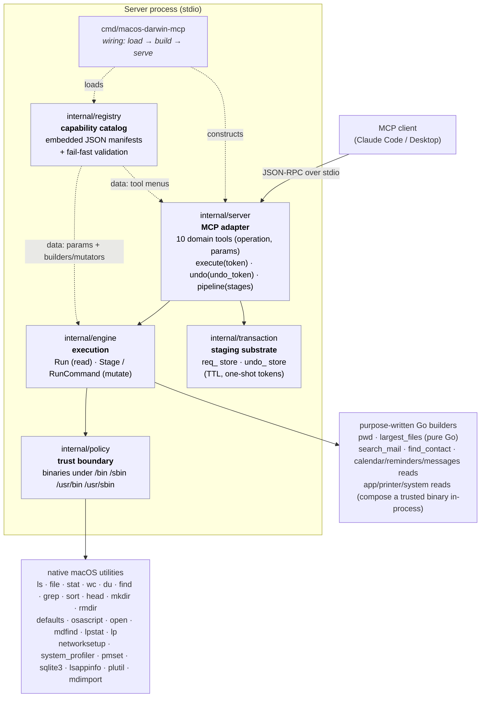
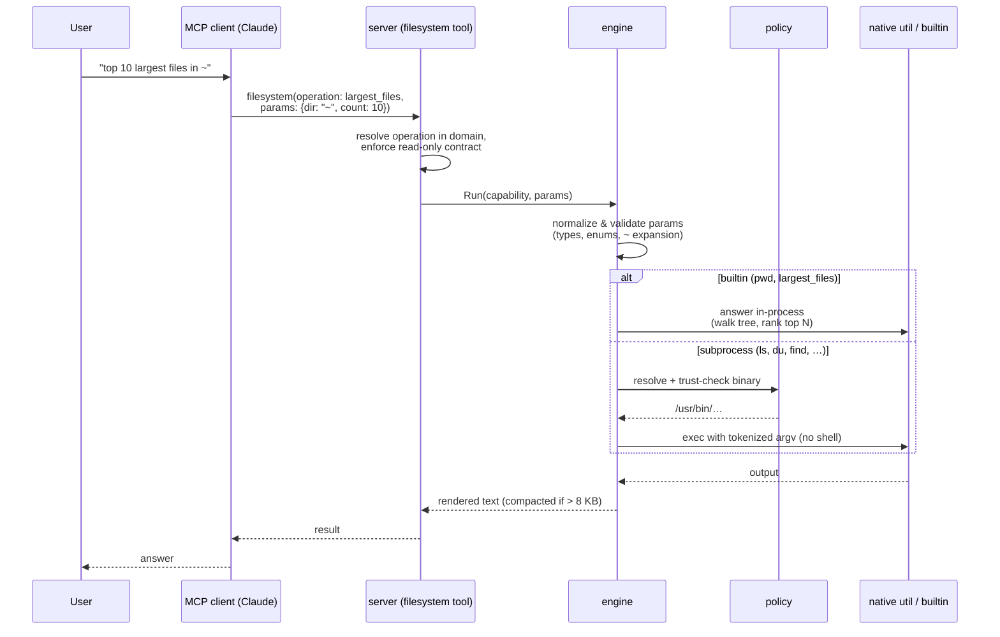
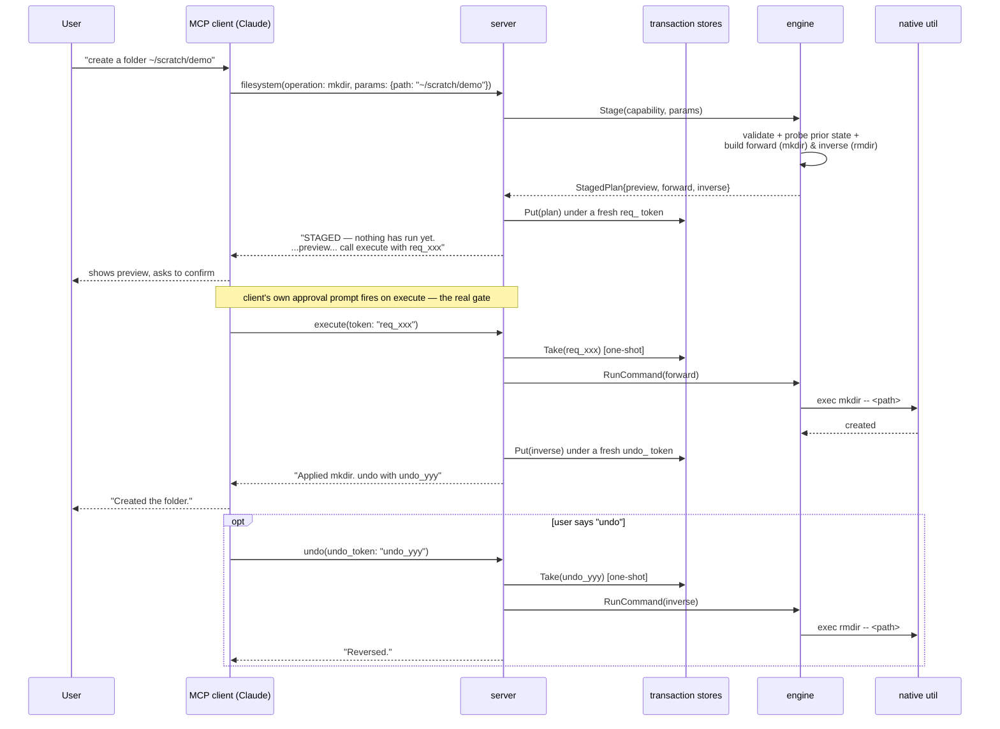

# Architecture & technical reference

> The user-facing tour lives in the [README](../README.md). **This** document is
> the engineering reference: how the server is structured, how a request flows,
> the complete capability catalog, the mutation model, the safety guarantees, and
> how to build/test/eval it.

## Contents

- [Why it's built this way](#why-its-built-this-way)
- [System design](#system-design)
- [Capabilities](#capabilities)
- [`pipeline`: composing capabilities](#pipeline-composing-capabilities)
- [Mutating operations (stage → execute → undo)](#mutating-operations-stage--execute--undo)
- [Why this server is safe to expose](#why-this-server-is-safe-to-expose)
- [Codebase structure](#codebase-structure)
- [Develop & test](#develop--test)
- [Evals](#evals)

---

## Why it's built this way

This codebase started as an MVP that registered one hand-written Go tool per
operation (`ls`, `grep`, `du`, …). That does not scale: every new operation meant
new tool code, and the model's tool list grew without bound. The server has since
been rebuilt around two ideas:

1. **Capabilities are data, not code.** Every operation is a JSON entry in a
   *capability manifest* describing the binary it runs, its parameters, and how
   those parameters map to command-line arguments. Adding an operation is a
   manifest edit, not new Go. A fixed **engine** turns any manifest entry into a
   validated, safely-executed command.

2. **The model sees domain tools, not the engine's plumbing.** Instead of one
   tool per operation (which doesn't scale) or a single opaque `query` tool (poor
   ergonomics), the server exposes **one tool per capability category**. You call
   a domain tool with an `operation` (a capability name) plus that operation's
   `params`. Each domain tool's description embeds the full menu of its operations
   and their parameters, so the model can form a correct call in one shot with no
   separate discovery step.

The net effect: the registry is the single source of truth, the engine enforces
every safety rule in one place, and the tool surface stays small and stable no
matter how many operations exist. Today the server exposes **10 domain tools**
(`filesystem`, `preferences`, `application`, `application-mail`,
`application-calendar`, `application-reminders`, `application-phone`,
`application-messages`, `printer`, `system`) plus three shared tools
(`execute`, `undo`, `pipeline`) — fronting **~47 operations** in total.

---

## System design



**Dependency direction is strictly one-way:** `server → engine → policy`, and all
three depend only on the registry's data types — never the reverse. That keeps the
catalog free of any execution or protocol concerns.

### How one request flows



### How a mutation flows



---

## Capabilities

Capabilities are grouped into categories, each reachable through its own domain
tool as `<domain>(operation: <name>, params: {…})`. Most operations are
read-only and run immediately; mutating ones go through the
[stage → execute → undo](#mutating-operations-stage--execute--undo) gate instead.

### `filesystem`

| Operation       | Runs            | Reversibility | Use it for                                        |
| --------------- | --------------- | -------------- | -------------------------------------------------- |
| `ls`            | `/bin/ls`       | read-only       | "What's in my Downloads folder?"                  |
| `pwd`           | *(builtin)*     | read-only       | "Where is the server running from?"               |
| `file`          | `/usr/bin/file` | read-only       | "What kind of file is this?"                      |
| `stat`          | `/usr/bin/stat` | read-only       | "When was this file last modified?"                |
| `wc`            | `/usr/bin/wc`   | read-only       | "How many lines are in this log?"                  |
| `du`            | `/usr/bin/du`   | read-only       | "How big is this folder?"                          |
| `find`          | `/usr/bin/find` | read-only       | "List all PNG and JPG files under `~/Pictures`."    |
| `grep`          | `/usr/bin/grep` | read-only       | "Which files mention `TODO`?"                       |
| `largest_files` | *(builtin)*     | read-only       | "What are the 10 biggest files under `~`?"          |
| `sort`          | `/usr/bin/sort` | read-only       | Rarely standalone — a [`pipeline`](#pipeline-composing-capabilities) stage that ranks another stage's output. |
| `head`          | `/usr/bin/head` | read-only       | Rarely standalone — a [`pipeline`](#pipeline-composing-capabilities) stage that trims a ranked/filtered result to a top-N answer. |
| `mkdir`         | `/bin/mkdir`    | **reversible**  | "Create a folder `~/scratch/demo`."                 |

### `preferences`

| Operation       | Runs              | Reversibility | Use it for                                        |
| --------------- | ----------------- | -------------- | -------------------------------------------------- |
| `write_setting` | `/usr/bin/defaults` | **reversible** | "Show hidden files in Finder." / "Auto-hide the Dock." |

`write_setting` does **not** take an arbitrary preference domain/key — it takes
a closed `setting` enum naming one of **19** curated, well-known,
non-security-relevant boolean toggles (see [Why `write_setting` is curated, not
generic](#why-write_setting-is-curated-not-generic) below for the full list and
the reasoning).

### `application-mail`

| Operation     | Runs                        | Reversibility    | Use it for                                  |
| ------------- | --------------------------- | ----------------- | -------------------------------------------- |
| `search_mail` | *(builtin: mdfind + mdls)*  | read-only          | "Find emails mentioning the invoice number." |
| `send_mail`   | `/usr/bin/osascript`        | **irreversible**   | "Email Alice to confirm tomorrow's meeting."  |

`search_mail` is Spotlight-backed (no Mail.app automation permission needed)
and has known precision gaps — see
`docs/issues/note-applescript-mail-search-deferred.md` for when an
AppleScript-backed alternative would do better (very new mail, recently
re-indexed archives, Junk/Spam, exact account/mailbox scoping).

`send_mail` is the registry's first **irreversible** capability — there is no
"unsend." It still goes through the same stage → execute confirmation gate as
every mutator (see [Mutating
operations](#mutating-operations-stage--execute--undo)), but `execute`
returns "this change cannot be undone" instead of an undo token, because
`StagedPlan.Inverse` is `nil` — that field already existed for exactly this
case; `send_mail` is just the first capability to use it.

`send_mail` takes an optional `attachments` parameter (one or more file
paths). Pass the exact path; if you only have a description of where the
file is ("in Downloads", "in a subfolder called scratch"), ask Claude to
locate it first with the `filesystem` tool, then attach the resolved path.
This also covers "find my tax return and email it"-style requests end to
end — as two ordinary sequential tool calls (`find`, then `send_mail`), not
via `pipeline`, which structurally cannot include `send_mail` (mutators are
permanently ineligible — see [`pipeline`: composing
capabilities](#pipeline-composing-capabilities)).

### `application-calendar`

| Operation        | Runs                   | Reversibility   | Use it for                                          |
| ---------------- | ---------------------- | --------------- | --------------------------------------------------- |
| `list_calendars` | `/usr/bin/osascript`   | read-only       | "Which calendars do I have?"                        |
| `query_events`   | `/usr/bin/osascript`   | read-only       | "What's on my calendar this week?"                  |
| `add_event`      | `/usr/bin/osascript`   | reversible      | "Put a dentist appointment on Thursday at 2pm."     |
| `modify_event`   | `/usr/bin/osascript`   | reversible      | "Move my 3pm review to 4pm."                        |
| `delete_event`   | `/usr/bin/osascript`   | reversible      | "Cancel the standup on Friday."                     |

### `application-reminders`

| Operation           | Runs                 | Reversibility | Use it for                                |
| ------------------- | -------------------- | ------------- | ----------------------------------------- |
| `list_reminders`    | `/usr/bin/osascript` | read-only     | "What reminders are due this week?"       |
| `add_reminder`      | `/usr/bin/osascript` | reversible    | "Remind me to call the bank on Monday."   |
| `modify_reminder`   | `/usr/bin/osascript` | reversible    | "Push the rent reminder to the 5th."      |
| `complete_reminder` | `/usr/bin/osascript` | reversible    | "Mark the dry-cleaning reminder done."    |
| `delete_reminder`   | `/usr/bin/osascript` | reversible    | "Delete the reminder about the gym."      |

Both domains drive Calendar.app / Reminders.app through their AppleScript
dictionaries via the same hardened `osascript` path as `send_mail` (a fixed,
reviewed script with every model value bound as `--`-terminated `argv` data;
see [Why this server is safe to expose](#why-this-server-is-safe-to-expose)).
The first use of each triggers a one-time macOS automation-permission prompt
(System Settings → Privacy & Security → Automation).

Unlike `send_mail`, every calendar/reminder mutation is **reversible**: staging
captures the prior state first, so undo deletes what was added, re-creates what
was deleted, or restores what was changed. The reads (`query_events`,
`list_reminders`) return each item's `uid`/`id` — pass that identifier to the
modify/complete/delete operations. See
`docs/issues/note-calendar-reminders-undo-fidelity.md` for the small fidelity
caveats (e.g. a re-created item gets a fresh internal id).

### `application-phone`

| Operation      | Runs                  | Reversibility    | Use it for                                  |
| -------------- | --------------------- | ---------------- | ------------------------------------------- |
| `find_contact` | `/usr/bin/osascript`  | read-only        | "What's Alice's number?"                    |
| `call`         | `/usr/bin/open`       | **irreversible** | "Call Mom." / "FaceTime Bob."               |

`find_contact` searches Contacts.app and returns matching people with their
labeled numbers (mobile/home/work). `call` places a real call by handing a
`tel:` / `facetime:` / `facetime-audio:` URL to `open`; like `send_mail` it is
**irreversible** (there is no "un-call") and so goes through the same
stage → execute confirmation gate, with the preview naming exactly who will be
dialed and how.

`call` takes either an explicit `number` **or** a `contact_name` it resolves at
confirmation time. If the name matches more than one person — or one person with
more than one number — the call is refused and the candidates are listed, so a
name is never dialed ambiguously.

**Choosing the method** is the model's call, guided by the operation
description, because the server cannot detect whether a number is reachable on
FaceTime or whether an iPhone is paired: default to `cellular` (a phone call
routed through a paired iPhone via Continuity); fall back to `facetime_audio`
when cellular isn't available or the person is best reached on FaceTime; use
`facetime_video` only when the user explicitly asks for a video or "FaceTime"
call. The first `find_contact` triggers a one-time Contacts automation-permission
prompt; see `docs/issues/note-phone-calling-limitations.md` for why method
selection can't be automatic.

### `application-messages`

| Operation            | Runs                  | Reversibility    | Use it for                                  |
| -------------------- | --------------------- | ---------------- | ------------------------------------------- |
| `check_messages`     | `/usr/bin/sqlite3`    | read-only        | "Any new messages?"                         |
| `search_messages`    | `/usr/bin/sqlite3`    | read-only        | "Find the text about the invoice."          |
| `read_conversation`  | `/usr/bin/sqlite3`    | read-only        | "Show my recent texts with Alice."          |
| `list_conversations` | `/usr/bin/sqlite3`    | read-only        | "What conversations have I had lately?"     |
| `send_message`       | `/usr/bin/osascript`  | **irreversible** | "Text Bob that I'm running late."           |

The four reads query the local Messages database (`~/Library/Messages/chat.db`)
with `sqlite3 -readonly -json`. Because that database is protected, the reads
require the host process to have **Full Disk Access** (System Settings →
Privacy & Security → Full Disk Access) — a heavier grant than the Automation
permission the other app domains use; until it is granted the reads return an
explanatory error. `read_conversation` takes a `handle` (phone/email) or a
`contact_name` resolved via Contacts (reusing the phone domain's resolver, with
the same ambiguity refusal).

`send_message` sends an iMessage through Messages.app and, like `send_mail`, is
**irreversible** — it goes through the stage → execute confirmation gate with the
recipient and full text shown verbatim, and offers no undo. It takes an optional
`attachments` parameter (one or more file paths — an image, PDF, etc.); each is
sent as an iMessage attachment, and the `text` is optional when at least one
attachment is supplied (so you can send a file with no caption). Each attachment
path is verified to exist and be a regular file before the plan is staged, and
the preview lists the attachments by filename. See
`docs/issues/note-imessage-applescript-send.md` (Messages' scripting `send` is
version-sensitive) and `docs/issues/note-messages-read-fda.md` (the Full-Disk-
Access requirement and the read-only, injection-safe query posture).

### `application`

| Operation                   | Runs                 | Reversibility    | Use it for                                       |
| --------------------------- | -------------------- | ---------------- | ------------------------------------------------ |
| `list_applications`         | `/usr/bin/mdfind`    | read-only        | "What apps are installed?"                        |
| `search_applications`       | `/usr/bin/mdfind`    | read-only        | "Find the app with 'note' in its name."          |
| `list_running_applications` | `/usr/bin/osascript` | read-only        | "What's open right now?"                          |
| `open_application`          | `/usr/bin/open`      | reversible *     | "Open Notes." (runs immediately)                 |
| `open_file`                 | `/usr/bin/open`      | reversible       | "Open Leah.png in Preview." / "Open this PDF." (staged) |
| `focus_application`         | `/usr/bin/osascript` | irreversible     | "Bring Safari to the front." (runs immediately)  |
| `quit_application`          | `/usr/bin/osascript` | irreversible     | "Quit Mail." (staged — confirm first)            |

`list_applications`/`search_applications` enumerate `.app` bundles via Spotlight
and filter by name **in Go** (so no untrusted text reaches `mdfind`, which has no
`--` terminator). `open_application` and `focus_application` use the **auto-commit
lane** (see below): they run at once rather than going through the confirmation
gate. `open_application` is reversible — *if it finds the app was not already
running*, undo quits it; if it was already open (we merely focused it), no undo is
offered. The "already running?" check uses Launch Services (`lsappinfo`), not a
System Events AppleScript probe, so it never trips an Automation permission prompt
on this otherwise-low-friction action. `quit_application` stays staged because
unsaved work could be lost. Focusing/quitting drive the app through `osascript`
and so need Automation permission the first time.

`open_file` opens a file, optionally in a specific app (e.g. a PNG in Preview); the
`app` parameter is optional, and omitting it opens the file in macOS's default
handler for its type (the forward command is simply `open -- <file>`, with no
support check to run and no app to quit on undo). It is **always staged** — every
open waits for confirmation — and when an app *is* named the preview tells you
whether that app actually handles the file's type, so you confirm with full context.
The check is read-only and Spotlight-independent: it reads the app bundle's
`Info.plist` document-type declarations with `plutil` (the extensions and UTIs it
opens) and the file's own type with `mdimport -t -d1` (used in preference to
`mdls`, which fails on files the Spotlight index hasn't seen). A match on the
file's extension or exact UTI yields a clean "Open file `<path>` with `<app>`.
Proceed?" preview; a confident mismatch, or an inconclusive result (the app
declares no document types — counted as none only when it actually names zero
extensions and zero UTIs — or it can't be
located, or the file's type can't be read), prepends a warning that the file may
not be supported. The verdict only shapes the preview text — the staged
forward/undo commands are identical regardless — so the confirmation gate is the
single place the open is allowed or abandoned. Reversibility mirrors
`open_application`: undo quits the app only if it wasn't already running.

### `printer`

| Operation         | Runs              | Reversibility    | Use it for                                  |
| ----------------- | ----------------- | ---------------- | ------------------------------------------- |
| `list_printers`   | `/usr/bin/lpstat` | read-only        | "What printers do I have, and are they on?" |
| `list_print_jobs` | `/usr/bin/lpstat` | read-only        | "What's in the print queue?"                |
| `print_file`      | `/usr/bin/lp`     | **irreversible** | "Print this PDF." (staged)                  |
| `print_test_page` | `/usr/bin/lp`     | **irreversible** | "Print a test page on the office laser."    |

Printing is irreversible (paper/ink), so `print_file`/`print_test_page` go through
the stage → execute confirmation gate with no undo. macOS ships no CUPS test page,
so `print_test_page` carries its own (embedded into the binary) and writes it to a
scratch file under `/tmp/mcp-fallback/` at stage time. **Connecting/re-enabling a
printer needs administrator rights** (`lpadmin`/`cupsenable`) that can't be
obtained over this transport — `list_printers` flags a disabled queue and points
you at `system`'s `open_settings` (pane `printers`) to finish in System Settings.

### `system`

| Operation             | Runs                      | Reversibility | Use it for                                    |
| --------------------- | ------------------------- | ------------- | --------------------------------------------- |
| `wifi_status`         | `/usr/sbin/networksetup`  | read-only     | "Is Wi-Fi on, and what am I joined to?"       |
| `list_preferred_wifi` | `/usr/sbin/networksetup`  | read-only     | "What networks does this Mac remember?"       |
| `bluetooth_status`    | `/usr/sbin/system_profiler` | read-only   | "Is Bluetooth on? What's connected?"          |
| `power_status`        | `/usr/bin/pmset`          | read-only     | "Battery level? Is Low Power Mode on?"        |
| `open_settings`       | `/usr/bin/open`           | irreversible  | Hand off to a System Settings pane.           |

The reads parse machine-readable output where it exists (`system_profiler -json`
for Bluetooth) and tolerant text parsing otherwise. `open_settings` is the guided
fallback for anything needing admin rights (joining Wi-Fi, toggling Bluetooth,
battery/Low-Power changes, connecting a printer): it uses the **auto-commit lane**
to open the requested pane immediately. The model picks a pane from a closed enum;
the engine maps that to a vetted **Ventura+** `x-apple.systempreferences:` URL
(macOS 13 is the minimum supported OS, so no per-version handling is needed).

### Accessibility & preference toggles

`preferences`' `write_setting` covers a curated allowlist of reversible,
non-security-relevant toggles. Alongside the Finder/Dock/keyboard entries it
includes accessibility toggles (`accessibility_reduce_motion`,
`accessibility_reduce_transparency`, `accessibility_increase_contrast`,
`accessibility_differentiate_without_color`) backed by `com.apple.universalaccess`.

### Three ways a read-only capability is fulfilled

The engine resolves each read-only capability through one of three builders,
chosen by the manifest's `builder` field:

- **Generic builder** (most operations) — a fully declarative mapping. Each
  parameter's rule says how it becomes an argument (e.g. `{all: true}` → `-A`),
  flags first, then a `--` terminator, then positional operands.
- **Named builder** (`find`, `grep`) — small purpose-written Go for grammars the
  generic mapping can't express (e.g. `find` needs its search root *first* and its
  name filters combined into one parenthesized OR group).
- **Builtin** (`pwd`, `largest_files`, and the app/mail/calendar/reminders/phone/
  messages/printer/system reads) — answered by purpose-written Go for questions a
  single declarative command can't express in one call. Some are pure Go with no
  subprocess (`pwd`, `largest_files`); others compose a trusted binary in-process
  (e.g. `search_mail` runs `mdfind` then `mdls`; the Messages reads run
  `sqlite3 -readonly -json`). `largest_files` is the clearest pure example:
  "biggest files" is a `du -a | sort -rn | head` *pipeline* idiom — a literal
  shell pipe is forbidden, and even the server-side `pipeline` tool below would
  need the model to assemble three stages for something this common — so the
  builtin walks the tree once, keeps only the top N in a bounded heap, and returns
  just those ranked lines in a single call. Output is small by construction and
  never floods the model's context.

A mutating capability is fulfilled differently — see [Mutating
operations](#mutating-operations-stage--execute--undo) below. Composing
*multiple* read-only capabilities together (when no single one or named
builtin already answers the question) is the `pipeline` tool's job — see the
next section.

---

## `pipeline`: composing capabilities

Some questions need more than one capability chained together — "how many
`.conf` files are under `/etc`?" needs `find` to list matches and `wc` to count
them — but don't justify a bespoke builtin the way `largest_files` did for
"biggest files." The `pipeline` tool is the general escape hatch: an ordered
list of stages where each stage's raw output feeds the next stage's input,
the server-side equivalent of a unix `a | b | c` pipe with no shell involved
(every stage is still launched via `exec.CommandContext` with its own
validated, explicit argv — see [Why this server is safe to
expose](#why-this-server-is-safe-to-expose)).

```
pipeline(stages: [
  { capability: "find", params: { path: "/etc", extensions: ["conf"] } },
  { capability: "wc",   params: { lines: true } }
])
```

Notice the second stage omits `paths` — that's how a stage consumes the
*previous* stage's output instead of a named file, the same way `wc` reads
stdin in a real shell pipe when given no file argument.

**Scope, deliberately narrow:**
- **Read-only, binary-backed capabilities only.** Builtins (`pwd`,
  `largest_files`) have no subprocess to pipe; mutators (`mkdir`,
  `write_setting`) don't run in one step at all. This also means a pipeline
  never mutates anything — there is nothing to roll back, ever, so composition
  stays orthogonal to the mutation phase's transactional machinery.
- **`wc`, `grep`, `sort`, and `head`** can appear as a *non-first* stage,
  reading the prior stage's output from stdin instead of a file (the classic
  unix filter idiom). A capability that accepts this is marked
  `accepts_stdin` in its manifest entry; calling one of these four directly
  (outside a pipeline) without a file argument is refused immediately with a
  clear error rather than hanging forever waiting for input that will never
  arrive.
- **Limits**: at most 5 stages; each intermediate stage's raw output is capped
  at 1 MiB (generous on purpose — that data never reaches the model, it only
  has to fit in the server's own memory; the *final* stage's output still goes
  through the normal 8 KB model-facing compaction). A failing stage (non-zero
  exit, or — for a non-final stage — exceeding that cap) aborts the whole
  pipeline immediately, naming which stage and why.
- **Sequential, not concurrently streamed.** Each stage runs to completion and
  its captured output becomes the next stage's input, rather than every stage
  running concurrently with a live OS-level pipe between them. Simpler and
  exactly as correct at this project's scale (a handful of capped stages); see
  `docs/issues/note-pipeline-design-decisions.md` for the reasoning.

**Nudged toward named operations first.** The tool's own description tells
the model to check the relevant domain tool's operation menu and prefer a
single named operation whenever one exists — composing a pipeline is meant for
the long tail no named capability covers yet. This is checked mechanically,
not just hoped for: several eval cases assert `forbid_tools: ["pipeline"]`
for prompts a single named operation already answers (see
[Evals](#evals)).

---

## Mutating operations (stage → execute → undo)

Read-only capabilities are a pure function of their parameters, so they run and
return in one call. A mutation cannot work that way: the only safe moment to show
a human what will happen — and the only moment the server can capture the prior
state needed to reverse it — is *after* validation but *before* anything runs. So
a mutating capability (selected by a manifest `builder` registered as a
**mutator**, e.g. `mkdir`) is split into three steps, bridged by opaque,
single-use, expiring tokens (`internal/transaction`):

1. **Stage** — calling the domain tool with a mutating `operation` does **not**
   run anything. The engine validates the parameters, does any read-only probing
   needed (e.g. confirming the target doesn't already exist), and resolves both
   the *forward* command and its *inverse* up front. The result is stashed
   server-side under a fresh `req_…` token; the model gets that token plus a
   plain-language preview ("Create directory X. Undo will remove it.").
2. **Execute** — the model calls the shared `execute` tool with the token. This
   is the only step that actually changes the system, and it is the step an MCP
   client should gate with its own "Allow this tool call?" approval prompt — that
   client-side prompt is the real, enforceable confirmation; anything the model
   says in chat ("shall I proceed?") is UX layered on top, not a lock. `execute`
   consumes the token (so a staged plan can be committed at most once) and, if
   the change is reversible, returns a fresh `undo_…` token.
3. **Undo** — the model calls the shared `undo` tool with that token to run the
   pre-resolved inverse command. Like `execute`, the token is consumed on use.

Both tokens expire on their own (15 minutes for a staged-but-uncommitted plan, 1
hour for a committed change's undo window), so an abandoned plan or a long-forgotten
change cannot be acted on far outside the period the preview/result was shown.

**Why `execute` and `undo` are tools, not capabilities:** they are generic over
*any* staged plan — the model never names an operation when calling them, only a
token. This is also why the architecture can add many more mutating capabilities
later without growing the tool surface: only the per-domain operation menu grows.

**The auto-commit lane.** Forcing the full token dance on every benign action
("open Notes") would be pure friction, so a mutating capability may declare
`auto_commit: true` in its manifest. Such an operation still goes through the
engine's stage step (so its forward and inverse are computed exactly the same
way), but the server commits the forward command **immediately** and, when the
change is reversible, returns an `undo_…` token in the same response — no separate
`execute` call. The registry confines this to low-stakes mutations: `auto_commit`
is rejected on a read-only capability and on anything risk `medium`/`high`, so
paper-consuming prints and lossy quits stay behind the confirmation gate.
Today's auto-commit operations are `open_application`, `focus_application`, and
`open_settings`. Each operation line in a domain tool's menu states its lane —
"runs immediately", "runs immediately; may return an undo token", or "STAGED —
confirm with the user, then execute" — so the model knows what a call will do up
front.

The mutators in the registry today span every undo shape the design anticipated:
- **`mkdir`** — forward is `mkdir -- <path>`, inverse is `rmdir -- <path>` (which
  refuses a non-empty directory, so undo can never destroy files added after the
  create). Staging refuses a path that already exists or begins with `-`.
- **`write_setting`** — unlike `mkdir`'s fixed inverse, undo here needs to know
  what to restore. Staging reads the setting's *current* value (a harmless
  `defaults read`) and bakes that exact prior value into the inverse: forward is
  `defaults write <domain> <key> -bool <new>`, inverse is either `defaults write
  <domain> <key> -bool <prior>` or, if the key was unset, `defaults delete
  <domain> <key>`. Staging refuses to proceed if the existing value isn't a plain
  boolean — it never guesses how to round-trip a value shape it doesn't
  understand.
- **`send_mail` / `send_message` / `call` / `print_file` / `print_test_page`** —
  **irreversible** mutators: there is no inverse to compute, because there is no
  "unsend"/"un-call"/"un-print." `StagedPlan.Inverse` is `nil`, which `execute`
  renders as "this change cannot be undone." The staged preview shows everything
  that matters **verbatim** — for `send_mail`, the recipient(s), subject, body,
  and attachment filenames — precisely because there's no second chance once
  `execute` runs:
  ```
  The following email will be sent to alice@example.com:

  Subject: ride from airport
  Body:
  Can you pick me up at 5:00pm from the airport? I'm flying Delta.
  Thanks!
  -Jerry

  This cannot be undone once sent — there is no "unsend." Send this email?
  ```
- **`add_event` / `modify_event` / `delete_event`**, **`add_reminder` /
  `modify_reminder` / `complete_reminder` / `delete_reminder`** — **reversible**
  mutators that capture prior state at stage time, so undo deletes what was added,
  re-creates what was deleted, or restores what was changed.
- **`open_application` / `quit_application`** — `open_application` is reversible
  via the auto-commit lane only when the app was not already running;
  `quit_application` is staged and irreversible.

### Why `write_setting` is curated, not generic

`defaults write` is, on its own, unrestricted within the calling user's account —
some settings it can reach are genuinely dangerous (e.g. disabling the password
prompt after sleep/screensaver). Exposing raw `domain`/`key` parameters would let
the model target *any* preference, most of which neither it nor a human glancing
at a confirmation prompt can assess the consequences of. So `write_setting` takes
a closed `setting` enum instead; the real domain/key pair behind each name lives
in Go (`internal/engine/mutate_preferences.go`'s `defaultsAllowlist`), never in
model-controlled input — the same posture `policy.allowedBinDirs` takes for
trusted binaries. A test (`TestDefaultsAllowlist_MatchesManifestEnum`) keeps the
manifest's enum and this Go map from drifting apart.

| `setting`                          | Domain                       | Key                                    |
| ----------------------------------- | ---------------------------- | --------------------------------------- |
| `finder_show_hidden_files`          | `com.apple.finder`           | `AppleShowAllFiles`                     |
| `finder_show_all_extensions`        | `NSGlobalDomain`             | `AppleShowAllExtensions`                |
| `finder_show_path_bar`              | `com.apple.finder`           | `ShowPathbar`                           |
| `finder_show_status_bar`            | `com.apple.finder`           | `ShowStatusBar`                         |
| `finder_warn_on_extension_change`   | `com.apple.finder`           | `FXEnableExtensionChangeWarning`        |
| `dock_autohide`                     | `com.apple.dock`             | `autohide`                              |
| `dock_show_recents`                 | `com.apple.dock`             | `show-recents`                          |
| `dock_minimize_to_app_icon`         | `com.apple.dock`             | `minimize-to-application`               |
| `dock_show_process_indicators`      | `com.apple.dock`             | `show-process-indicators`               |
| `screenshot_disable_shadow`         | `com.apple.screencapture`    | `disable-shadow`                        |
| `global_press_and_hold_accents`     | `NSGlobalDomain`             | `ApplePressAndHoldEnabled`               |
| `global_autocorrect`                | `NSGlobalDomain`             | `NSAutomaticSpellingCorrectionEnabled`  |
| `global_smart_quotes`               | `NSGlobalDomain`             | `NSAutomaticQuoteSubstitutionEnabled`   |
| `global_smart_dashes`               | `NSGlobalDomain`             | `NSAutomaticDashSubstitutionEnabled`    |
| `global_period_substitution`        | `NSGlobalDomain`             | `NSAutomaticPeriodSubstitutionEnabled`  |
| `accessibility_reduce_motion`       | `com.apple.universalaccess`  | `reduceMotion`                          |
| `accessibility_reduce_transparency` | `com.apple.universalaccess`  | `reduceTransparency`                    |
| `accessibility_increase_contrast`   | `com.apple.universalaccess`  | `increaseContrast`                      |
| `accessibility_differentiate_without_color` | `com.apple.universalaccess` | `differentiateWithoutColor`      |

Every entry is a well-documented, reversible, purely cosmetic/UX/accessibility
toggle with no security, login, or networking implications — settings of that kind
(password prompts, login window behavior, firewall, Gatekeeper, sharing,
FileVault, TCC, SIP, etc.) are deliberately excluded and are not planned to be
added. Adding a new curated setting means a reviewed Go code change (the
allowlist) plus a manifest edit (the enum) — not just a data edit — which is
intentional friction for something security-adjacent. An open "any domain/key"
mode has been considered and rejected: the curation *is* the safety value, not a
speed bump in front of one, and a confirmation prompt doesn't help if nobody
reviewing it knows what an arbitrary key actually does.

---

## Why this server is safe to expose

- **No shell, ever.** Every utility is invoked with `exec.CommandContext` and a
  pre-tokenized `[]string`. There is no `sh -c`, no string concatenation, no glob
  expansion performed by us.
- **Trusted binaries only.** Each binary is resolved and verified to live under
  `/bin`, `/sbin`, `/usr/bin`, or `/usr/sbin` before it can run — for read-only
  commands, a mutation's forward/inverse commands, and every stage of a
  `pipeline` call alike; there is no separate, looser execution path for
  composed stages.
- **Mutations never run on the first call.** `find` is still exposed without
  `-exec`, `-delete`, or `-prune`. Any capability that changes state instead goes
  through [stage → execute → undo](#mutating-operations-stage--execute--undo):
  the model gets a token and a preview, and only a separate `execute` call —
  meant to be gated by the client's own approval prompt — can change anything.
  `execute` takes a token, never a raw command, so the model cannot smuggle in a
  different action between staging and execution.
- **Strict input validation.** Every parameter is checked against its manifest
  spec (type, required-ness, enum membership) before any argument is assembled.
  `find`'s `extensions` filter rejects anything but `[A-Za-z0-9_-]+`; its `type`
  is restricted to `f`, `d`, or `l`; dash-leading search roots are rejected so
  they can't be reinterpreted as flags.
- **Output budget.** Subprocess output larger than 8 KB is compacted to a
  head + tail window with a notice, so a verbose utility can't saturate the
  model's context. A `pipeline` call's intermediate stages are capped more
  generously (1 MiB — that data never reaches the model, only the server's own
  memory), but the *final* stage a pipeline returns still goes through the
  same 8 KB model-facing compaction as any other result.
- **Stdout discipline.** All logs go to `os.Stderr`; `os.Stdout` is reserved
  exclusively for JSON-RPC framing.
- **macOS permission model.** The server runs as the user that started it and
  inherits their Full-Disk-Access, Files-and-Folders, and POSIX permissions.
  Permission denials surface verbatim from the underlying utility (look for
  `[stderr]` in tool output). Automating Mail.app (`send_mail`), Calendar.app,
  Reminders.app, Contacts (`find_contact`), or Messages (`send_message`)
  additionally requires a one-time Automation permission grant, prompted the
  first time each runs; the Messages *reads* require Full Disk Access — same UX
  pattern, just a different macOS permission category.
- **No AppleScript injection.** Several capabilities (`send_mail`, `send_message`,
  `find_contact`, all of `application-calendar` and `application-reminders`, app
  focus/quit) drive a scripting language richer than a flag set, so the no-shell
  discipline above gets a single hardened counterpart for all of them in
  `internal/engine/applescript.go`. Every AppleScript source is a fixed,
  reviewed constant, never built by concatenating model-supplied text, and
  all values arrive as plain `argv` elements bound by AppleScript's own
  `on run argv` handler — data, never parsed as code. Crucially, that shared
  path always inserts a `--` end-of-options terminator between the script and
  the first value, so a value beginning with `-` (e.g. a subject or event
  title of `-e`) can never be parsed as an `osascript` option and executed as
  script — *option* injection, which argv-splitting alone does **not** stop.
  Attachment paths (`send_mail`, `send_message`) are also verified to exist and
  be regular files before staging.
- **No URL-scheme injection.** `call` places a call by handing a URL to
  `/usr/bin/open`. Splitting argv stops shell injection but would *not* stop a
  model from supplying a value like `file:///…` or `http://…` that `open` would
  launch as a different scheme. So the URL is **built in Go** from a number that
  `canonicalizePhoneNumber` (`internal/engine/mutate_phone.go`) has reduced to
  digits and an optional leading `+` — anything else (letters, a `:` or `/`, an
  interior `+`) is rejected. The scheme (`tel:` / `facetime:` /
  `facetime-audio:`) is chosen by code, never by the model, so `open` can only
  ever receive a call URL this server constructed.
- **No SQL injection.** The `application-messages` reads query the Messages
  database with `sqlite3`. Every query is a fixed template; the only variable
  pieces are a numeric `LIMIT` (formatted from a Go `int`, never a string) and a
  handle or search term, which is either validated to a form that cannot contain
  a quote (a phone reduced to digits, a checked email) or embedded with
  `escapeSQLLiteral` (`internal/engine/builtins_messages.go`), which doubles `'`
  — the complete and only escaping a single-quoted SQLite literal needs. The
  database is opened `-readonly` as defense in depth, so even a hypothetical
  escaping miss could only read, never modify.

---

## Codebase structure

```
cmd/
  macos-darwin-mcp/
    main.go                    # entry point — wiring only: load registry → build server → serve over stdio
  runevals/
    main.go                    # eval harness entry point — flags → internal/evals.Run (see "Evals")

internal/
  registry/                    # the capability catalog (pure data; no exec, no MCP)
    types.go                   #   Capability / ParamSpec / ArgRule + closed enums
    registry.go                #   embed + load + fail-fast structural validation
    manifests/
      filesystem.json          #   12 filesystem capabilities (incl. sort/head + mkdir) as JSON data
      preferences.json         #   write_setting (the curated 19-entry "setting" enum) as JSON data
      mail.json                #   search_mail + send_mail (irreversible, optional attachments)
      calendar.json            #   list_calendars/query_events/add/modify/delete_event
      reminders.json           #   list/add/modify/complete/delete_reminder
      phone.json               #   find_contact (read) + call (irreversible)
      messages.json            #   check/search/read_conversation/list_conversations + send_message (irreversible)
      application.json          #   list/search/list_running + open/focus/quit_application
      printer.json             #   list_printers/list_print_jobs + print_file/print_test_page (irreversible)
      system.json              #   wifi/list_preferred_wifi/bluetooth/power status + open_settings
  engine/                      # execution: turn a capability + params into output
    engine.go                  #   Run pipeline (read): normalize → builder/builtin → policy → exec
    validate.go                #   parameter normalization & type coercion (input guardrail)
    argbuild.go                #   generic declarative argv builder + typed accessors
    applescript.go             #   shared hardened osascript seam: the "--" terminator + AppleScript date helpers
    builders_filesystem.go     #   named builders for irregular grammars (find, grep)
    builtins.go                #   builtin registry (pwd)
    builtins_filesystem.go     #   largest_files in-process tree walk + ranking
    builtins_mail.go           #   search_mail: composes mdfind + mdls
    builtins_calendar.go       #   list_calendars + query_events reads (osascript → parse)
    builtins_reminders.go      #   list_reminders read (osascript → parse)
    builtins_phone.go          #   find_contact read + resolveContactNumbers (shared with call)
    builtins_messages.go       #   Messages reads via sqlite3 -readonly -json on chat.db; SQL-injection guards
    builtins_apps.go           #   list/search/list_running applications reads (mdfind + osascript)
    builtins_printers.go       #   list_printers + list_print_jobs reads (lpstat parsing)
    builtins_system.go         #   wifi/bluetooth/power status reads (networksetup/system_profiler/pmset)
    executor.go                #   subprocess runner, ~ expansion, 8 KB output compaction; runCommandWithStdin
    mutate.go                  #   generic mutation machinery: Mutator/Command/StagedPlan, Stage/RunCommand
    mutate_filesystem.go       #   mkdir mutator
    mutate_preferences.go      #   write_setting mutator + the defaultsAllowlist curated settings map
    mutate_mail.go             #   send_mail mutator (irreversible)
    mutate_calendar.go         #   add/modify/delete_event mutators (reversible; probe-then-stage)
    mutate_reminders.go        #   add/modify/complete/delete_reminder mutators (reversible)
    mutate_phone.go            #   call mutator: validates number, builds tel:/facetime: URL, open (irreversible)
    mutate_messages.go         #   send_message mutator (irreversible, optional file attachments)
    mutate_apps.go             #   open/focus/quit_application mutators (auto-commit lane; lsappinfo running-check)
    mutate_printers.go         #   print_file/print_test_page mutators (irreversible; embedded test page)
    mutate_system.go           #   open_settings mutator (auto-commit; vetted x-apple.systempreferences URLs)
    pipeline.go                #   RunPipeline: chains read-only, binary-backed stages (see "pipeline" above)
  policy/
    binaries.go                # the trust boundary: which binaries may run, and from where
  transaction/                 # the stage↔execute/undo bridge (no deps on engine/registry/MCP)
    store.go                   #   generic, thread-safe, TTL one-shot token store
  server/                      # the MCP adapter (depends on engine + registry + transaction)
    tools.go                   #   domain tools + execute/undo; the request handlers
    menu.go                    #   render each domain tool's embedded operation/param menu
    pipeline.go                #   the pipeline tool: resolves stage names + renders its description
    inprocess.go               #   Connect(): wires a real Server to an in-memory MCP client,
                               #   shared by the integration test and the eval harness
  evals/                       # the eval harness's logic (see "Evals"); not part of the shipped binary
    case.go                    #   Case/Turn/Expectation types + LoadCases (JSON, not YAML — zero new deps)
    anthropic.go               #   minimal net/http Messages API client
    runner.go                  #   the agent loop: real model ↔ real server, capped at 6 rounds/turn
    expectation.go             #   pure CheckExpectation logic (unit tested with no network)

evals/
  cases/                       # the actual eval fixtures (dev-only data, never embedded in the binary)
    domain_selection.json
    filesystem_reads.json
    mail.json
    mutation_confirmation.json
```

The architectural ground rules behind these choices live in `CLAUDE.md` and
`.claude/rules/*.md`; the design rationale is recorded in `docs/ideas/` and
`docs/specs/`.

---

## Develop & test

```bash
gofmt -l ./cmd ./internal   # should print nothing
go vet ./...
go test ./...
go test -race ./internal/transaction/...   # the concurrent token store
```

See `docs/TESTS.md` for a per-package breakdown of what the suite actually
verifies (and what it deliberately doesn't — see the eval-harness note there).
The in-process MCP integration test (`internal/server/integration_test.go`) is
the canonical end-to-end check; piping JSON into the binary by hand is
unreliable because the server exits on stdin EOF before flushing replies (see
`docs/issues/issue-stdio-smoke-test-unreliable.md`).

Tests that exercise `write_setting` never run `defaults write`/`delete` against
the real curated domains (`com.apple.finder`, `com.apple.dock`,
`NSGlobalDomain`) — they use a synthetic allowlist entry pointed at a disposable
temp file instead, so running the suite never touches your actual Finder/Dock
settings.

---

## Evals

`go test ./...` proves the engine/protocol are correct *given* a specific tool
call. It cannot catch a different failure mode: a real model picking the
*wrong* tool for a prompt, or — the safety-critical case — calling `execute`
in the same turn it staged a change, without a human ever seeing the preview.
That needs an actual model in the loop, which `internal/evals` provides.

```bash
# Free, no API key needed: validates case files and resolves tool schemas only.
go run ./cmd/runevals -dry-run

# Live: makes real, billed Anthropic API calls (a few cents for the full set).
export ANTHROPIC_API_KEY=sk-ant-...
go run ./cmd/runevals
go run ./cmd/runevals -only mkdir_stages_then_confirms_then_undoes   # one case
```

How it works: for each case in `evals/cases/*.json` (**18 cases** today), the
harness sends the prompt to `claude-sonnet-4-6` with the *real* domain tool
schemas attached (read straight off the live in-process server via
`server.Connect` — the same helper the integration tests use, no hand-duplicated
schemas). Any tool the model calls is executed for real against the real engine;
the result is fed back, and the exchange repeats (capped at 6 rounds — exceeding
that is itself a reported failure, mirroring the original `largest_files` loop
incident) until the model yields back to the user. The case's `expect` block is
then checked: which tool/operation was called, which tools must NOT have been
called (`forbid_tools`, the auto-confirm guard), and any required substrings in
the response text.

**Scope caveat:** the real, enforceable confirmation gate on `execute` is the
MCP *client's* own "Allow this tool call?" prompt — something a raw Messages
API call has no concept of. This harness measures a narrower, softer signal:
does the model, given only the tool descriptions and conversation, naturally
avoid chaining stage→execute in one turn. That's worth catching but is not a
substitute for the client-side gate.

**Mutation cases have real side effects, by design** — `mkdir_*` cases really
create a directory under `/tmp` (a fresh `{{unique}}`-templated name each run,
so reruns never collide) and `write_setting_*` cases really flip a real Finder
preference. Both are written as 3-turn stage→confirm→undo scripts so a fully
passing live run is self-cleaning; see `evals/cases/mutation_confirmation.json`.

**`send_mail` is the one case with no possible self-cleaning**, since it's
irreversible — there is no undo turn to script. Its eval case
(`evals/cases/mail.json`) is deliberately single-turn with `forbid_tools:
["execute"]` and is never followed by a confirmation, so a live run can never
reach `execute` for it under any circumstance. `search_mail`'s case is safe to
actually execute (read-only), but uses a query engineered to match no real
mail, so real personal email content never flows through to the Anthropic API
as part of a tool result.

See `docs/issues/issue-need-eval-harness-for-tool-selection.md` for the
original design rationale, and `docs/TESTS.md` for how this fits alongside the
regular test suite.
